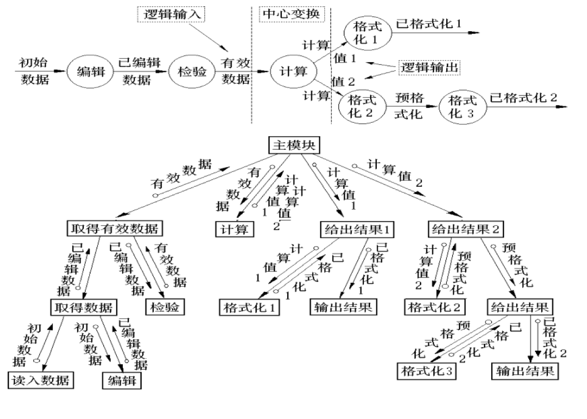

# 一 软件工程概述

> 软件的定义
>
> 软件的发展和软件危机
>
> 软件工程的概念

程序的定义：程序=算法+数据结构。

**软件的定义**：<u>软件是包括程序、数据及其相关文档的完整集合</u>。程序和数据是构造软件的基础，文档是软件质量的保证，也是保证软件更新及生命周期长短的必需品。

---

软件危机：计算机软件在开发和维护过程中遇到一系列严重问题，导致软件行业的信任危机。具体表现在：

- 软件的开发成本难以估算，无法制定合理的开发计划。
- 用户的需求无法确切表达。
- 软件质量存在问题。
- 软件的可维护性差。
- 缺乏文档资料。

产生软件危机的原因：

- 软件系统本身的复杂性。
- 软件开发的方法和技术不合理不成熟。

---

软件工程定义：运用工程化原则和方法，组织软件开发解决软件危机。

软件工程的三要素：<u>方法、工具、过程</u>。方法提供了“如何做”的技术、工具提供了自动或半自动的软件支撑环境、过程将方法和工具综合起来以达到合理及时地进行计算机软件开发的目的。

**软件工程的目标**：在<u>给定成本和时间</u>的前提下，开发出满足用户需求且具有<u>正确性、可用性</u>等因素的软件产品。

软件工程项目三个基本目标：合理的进度、有限的经费、一定的质量。（和上条类似）

软件工程的终极目标：摆脱手工生产软件的状况，逐步实现软件研制和维护的自动化。

# 二 生命周期模型

> 软件生命周期概念
>
> 传统软件生命周期模型
>
> 新型软件生命周期模型

软件工程项目三个基本目标：合理的进度、有限的经费、一定的质量。

戴明环：PDCA——Plan，Do，Check，Action。

<u>软件工程过程</u>是为了获得软件产品，在软件工具的支持下由软件工程师完成的一系列软件工程活动。主要活动：

- 软件规格说明：规定软件功能及其使用限制。
- 软件开发：产生满足规格说明的软件。
- 软件确认：通过有效性验证以保证软件能够满足客户要求。
- 软件演进：为了满足客户变更要求，软件在使用过程中不断地改进。

---

软件生命周期概念：软件产品从考虑其概念开始，到该产品不再使用为止的整个时期。包括<u>概念阶段、分析与设计阶段、构造阶段、移交和运行阶段</u>等不同时期。

软件生命周期六个基本步骤：<u>制定计划 P、需求分析 D、设计 D、程序编码 D、测试 C、运行维护 A</u>。

软件过程模型：从一个特定角度提出的对软件过程的概括描述，是对软件开发过程的抽象，包括构成软件过程的各种<u>活动、软件工件、参与角色</u>等。

**软件生命周期模型**：一个框架，描述整个软件生命周期内，软件开发、运行、维护所实施的全部<u>过程、活动、任务</u>。同时<u>描述生命周期不同阶段产生的软件工件（Artifact），明确活动的执行角色</u>等。

## 传统软件生命周期模型

传统模型种类：瀑布模型、演化模型、增量模型、喷泉模型、V&W 模型、螺旋模型、构件组装模型、快速应用开发模型、原型方法。

瀑布模型：<u>**是所有其他软件生命周期模型的基础**</u>。

- 文档驱动，本阶段的工作对象来自于上一阶段活动的输出文档。
- 优点：
  - 降低开发复杂度、提高透明性可管理性。
  - <u>推迟了软件实现，强调必须先分析和设计。</u>
  - 以文档评审等手段指导整个开发过程。
- 缺点：
  - 缺乏灵活性，无法解决需求不明或不准确的问题。
  - 风险控制能力较弱。
  - 文档过多时，增加工作量。文档并不能完全反映实际项目情况，导致错误结论。
- 适用范围：为早期软件开发消除非结构化软件、降低复杂度、促进软件工程化有显著作用。（就是没什么用）

演化模型：

- 提倡两次开发：第一次得到试验性的原型产品，探索可行性，明确需求。第二次在此基础上开发成品。
- 优点：
  - 明确用户需求、提高系统质量、降低开发风险。
- 缺点：
  - 难于管理、结构较差、技术不成熟。
  - 可能会抛弃瀑布模型的文档控制优点。
  - 缺乏设计，可能导致软件系统结构较差。
- 适用范围：需求不清楚、小型系统、开发周期短。

增量模型

- 首先对系统最核心或最清晰的需求进行分析、设计、实现、测试。再按优先级逐步对后续的需求进行上述开发工作。<u>结合了瀑布模型和演化模型的优点。</u>
- 优点：
  - 第一次增量实现系统核心功能，增强客户使用系统的信心。
  - 先开发核心功能，项目总体失败风险较低。
  - 最高优先级的功能先开发，得到最多测试，保障可靠性。
  - 增量在同一体系指导下进行集成，提高稳定性和可维护性。
- 缺点：
  - 难以选择增量粒度。
  - 难以确定所有需求。

喷泉模型（迭代模型）：

- 高情商：各个开发阶段没有特定次序要求，可以并行进行，可以随时补充遗漏的需求（低情商：想到什么做什么，瞎 JB 写）。
- 优点：提高开发效率、缩短开发周期。
- 缺点：难于管理。
- 适用于：需求不明晰。

V 和 W 模型：

- 在瀑布模型基础上改进，把测试活动提前，使得模型能够驾驭风险。

螺旋模型：

- 分为四个象限螺旋上升：制定计划、风险分析、实施工程、客户评价——进入下一回路。
- 适用于：开发周期长、风险高的大型软件。

构件组装模型：

- 模块化思想，使用复用构件库的组件搭建系统。

- 优点：
  - 软件复用、提高效率。
  - 允许多项目同时开发，降低费用、提高可维护性。
- 缺点：
  - 缺乏通用构建组装标准风险较大。
  - 构建可重用性与系统高效性不易协调。
  - 过分依赖构件，构件质量影响产品质量。

快速应用开发模型（RAD）：

- 开发周期 60-90 天，分小组同步进行软件各部分开发。
- 缺点：时间短，需要强沟通配合。不适合所有应用。
- 适用于：信息管理系统的开发。

原型方法：和增量好像也没什么区别。

- 主要用于明确需求。

## 新型软件生命周期模型

RUP 模型：基于瀑布模型演化而来。

- 软件生命周期分解为 4 各阶段：<u>初始阶段、细化阶段、构造阶段、移交阶段</u>。每个阶段结束于一个重要的<u>里程碑</u>。在阶段结尾评估是否满足阶段目标，评估通过允许项目进入下一阶段。
  - 初始阶段：软件目标里程碑。细化阶段：体系结构里程碑。构造阶段：运行能力里程碑。移交阶段：产品发布里程碑。
- 特点：用例驱动，软件体系结构为核心，应用迭代及增量。

XP 极限编程：基于敏捷建模思想，也是瀑布模型演化而来。

- 强调用户满意，开发人员可以对需求的变化作出快速反应。

# 三 软件需求分析

> 需求分析的对象、任务、目标
>
> 数据、功能、行为建模
>
> 需求类别

## 需求分析的对象、任务、目标

需求分析的必要性：允许开发人员对问题细化并构建分析模型：

- 数据模型：哪些数据进出系统、哪些数据需要存储？
- 功能模型：对数据进行处理的功能有哪些？
- 行为模型：数据进出系统和被系统功能处理的场景。

需求分析的对象：用户要求。

需求分析的任务：准确地定义新系统的目标，<u>回答</u>系统“做什么”的问题，**<u>编写需求规格说明书</u>**（结果）。

需求分析的目标：导出目标系统的逻辑模型，<u>解决</u>目标系统“做什么”的问题。

需求分析的操作性原则：

- 表示和理解问题的**信息域**（数据）。
- 定义软件**功能**。
- 表示软件**行为**。

用户需求说明书与软件需求规格说明书的区别：前者主要采用自然语言来表达用户需求，后者采用规范的建模语言表示。<u>后者是前者的细化，更多地采用计算机语言和图形符号来刻画需求。软件需求规格说明书是软件系统设计的直接依据。</u>

需求规格说明书的内容：需求分析模型。（描述系统需要做什么，而非如何做系统）

- 给出**当前系统及目标系统**的逻辑视图，以及**当前系统**的物理视图。
  - 逻辑模型给出软件要达到的功能和处理数据之间的关系，而非实现细节。
  - 物理模型给出业务环境中的业务实体和业务处理流程，是抽象出当前系统逻辑模型的基础。

~~常用的建模分析方法有：SA（面向数据流的结构化分析方法）、JSD（面向数据结构的 Jackson 方法）、OOA（面向对象的分析方法）等。~~

## 数据、功能、行为建模

数据模型：信息和内容关系、信息流、信息结构。

功能模型：对进入软件的信息和数据进行变换的模块，必须至少完成“输入、处理、输出”三个功能。

行为模型：大多数软件对来自外界的事件做出反应。行为模型创建了软件状态的表示，以及导致软件状态变化的事件的表示（状态机）。

## 需求类别

**功能需求**：列举出所开发软甲你在功能上应做什么（最主要需求）。

**性能需求**：给出所开发软件的技术性能指标。系统的实时性和其他时间要求（响应时间、处理时间、消息传送时间等）、资源配置要求、精确度、数据处理量等其他要求。

**环境需求**：软件系统运行时所处环境的要求。① 硬件方面，采用什么机型、有什么外部设备、数据通信接口等。② 软件方面，采用什么支操作系统、数据库管理系统等。③ 使用方面，需要使用部门在制度上、人员技术水平上具备什么样的条件等。

其他需求类别：

- 可靠性需求：软件的有效性和数据完整性。
- 安全保密需求。
- 用户界面需求。
- 资源使用需求：指所开发软件运行时所需的数据、软件、内存空间等各项资源。以及软件开发时的人力物力需求。
- 软件成本消耗与开发进度需求：软件项目立项之后，根据合同规定，对软件开发的进度和步骤费用提出要求，作为开发管理依据。
- 预估将来系统可能达到的目标：在开发过程中对系统将来可能的扩充与修改做准备。

# 四 面向对象分析

> 领域建模
>
> 用例建模

面向对象的需求分析建模：领域模型和用例模型。

- 领域模型表示需求分析阶段“当前系统”逻辑模型的静态结构及业务流程。
- 用例模型是“目标系统”的逻辑模型，定义了目标系统“做什么”的需求。由用例图、用例说明、系统顺序图 SSD、操作契约 Operation Contract 四部分组成。


## UML 概念及画法

UML：面向对象的统一<u>建模</u>语言。是一种<u>建模语言规格说明</u>，是一种表示的标准。不是过程也不是方法，但允许任何一种过程和方法使用它。

4+1 视图：从不同视角为系统架构建模，形成系统的不同视图。分别为：

- 用例视图（用户模型视图、场景视图）：强调从用户角度看到的或需要的系统功能。
- 逻辑视图（结构模型视图、静态视图）：展现系统的静态或结构组成及特征。
- 进程试图（行为模型视图、过程视图、协作视图、动态视图）：描述设计的并发和同步等特性，关注系统非功能性需求。
- 构件视图（实现模型视图、开发视图）：关注代码的静态组织与管理。
- 部署视图（环境模型视图、物理视图）：描述硬件的拓扑结构以及软件和硬件的映射问题，关注系统非功能性需求（性能、可靠性等）。


UML 的 9 个基本图：

- <u>用例图 Use Case Diagram：从用户的角度描述系统的功能。</u>
- <u>类图 Class Diagram：描述系统的静态结构（类及其相互关系）。</u>
- 对象图：描述系统在某个时刻的静态结构（对象及其相互关系）。
- <u>顺序图 Sequence Diagram：按时间顺序描述系统元素间的交互。</u>
- <u>协作图 Collaboration Diagram：按照时间空间的顺序描述系统元素间的交互和他们之间的关系。</u>
- 状态图：描述系统元素（对象）的状态条件和响应。
- 活动图：描述了系统元素之间的活动。
- 构件图：描述了实现系统的元素（类或包）组织。
- 部署图：描述了环境元素的配置并把实现系统的元素映射到配置上。

UML 视图与图的关系：

- 用例视图——用例图。
- 逻辑视图——类图、对象图、顺序图/协作图。
- 进程试图——状态图、活动图。
- 构件视图——构件图。
- 部署视图——部署图。

UML 图的画法：

- 类的基本结构：类名+属性+操作()。
  - 构建领域模型时，不需要操作()。


- 类之间的关系：


## 领域模型

领域模型：领域内**概念类**或**对象**的抽象可视化表示（将客观世界中的事物可视化抽象化）。主要用于概括地描述**业务背景**和重要的**业务流程**，通过类图和活动图展示。

- 业务背景：描述概念类之间的关系，表示成能够代表业务知识结构的<u>类图</u>。
- 业务流程：由角色及其执行的活动构成。由<u>活动图</u>描述。

创建领域模型的步骤：

1.  找出当前需求中的<u>候选概念类</u>。
2.  在领域模型中描述这些<u>概念类</u>。用问题域中的词汇对概念类命名，将与当前需求无关的概念类排除。
3.  在概念类之间<u>添加必要的关联</u>来记录关系。用关联、继承、组合/聚合表示。
4.  在概念类中<u>添加</u>用来实现需求必要的<u>属性</u>。

识别概念类或属性：

- 属性一般是可以赋值的（如数字、文本），而概念类不可以。
- 如果对一个名词是概念类还是属性不确定，将其作为概念类处理。
- 不存在名词到类的映射机制，因为自然语言具有二义性。

领域模型示例：


## 用例模型

用例模型是“目标系统”的逻辑模型，定义了目标系统“做什么”的需求。由四部分组成：

- 用例图
- 用例说明
- 系统顺序图 SSD
- 操作契约 Operation Contract

---

用例图：由三个基本元素组成。

- Actor：称为角色或参与者，使用系统的对象（不一定是人）。
- Usecase：用例，描述<u>角色如何使用系统功能实现需求目标</u>的一组成功场景和一系列失败场景的集合。
- Association：角色和用例之间的关系、用例和子用例之间的关系。

用例图示例：


---

系统顺序图 SSD：确定角色与系统之间的交互关系，以代码风格命名。包含：

- 角色。
- 代表软件系统的对象，一般使用 system 或系统命名。
- 角色与 system 之间的交互信息，简称消息或操作。

SSD 示例：


---

操作契约：为系统操作定义。领域模型中业务对象接收到系统事件后，执行必须的业务处理时各业务对象的状态以及系统操作执行的结果。


操作契约示例：


# 五 结构化需求分析方法

> 数据建模
>
> 功能建模
>
> 行为建模

数据建模：

- 概念性数据模型基于实体-关系（ER）法，也称为实体关系模型。描述了从用户角度看到的数据，反映用户现实环境，但与软件系统中的实现方法无关。

- 数据对象描述：描述了数据对象实体的名称及其所有属性。

- 数据对象的基数：一对一、一对多、多对多。

## 数据流图

功能建模：当数据或信息流过计算机系统时被系统功能所处理、加工、变换后再从系统输出处理后的数据，表现为**数据流图**。

数据流图的结构：由加工、外部实体、数据流、数据存储组成。

分层数据流图：

- 顶层数据流图：顶层流图仅包含一个加工，它代表被开发系统，其作用在于表明被开发系统的范围，以及它和周围环境的数据交换关系。
- 中间层数据流图：表示对其上层父图的细化。它的每一加工可以继续细化，形成子图。中间层次的多少视系统的复杂程度而定。
- 底层数据流图：是指加工不须再做分解的数据流图，称为“原子加工”。


数据词典：对于数据流图中出现的所有被命名的图形元素加以定义，使得每一个图形元素的名字都有一个确切的解释。其定义应是严密的、精确的，不可有半点含混并消除二义性，它由以下内容组成：

- 数据流词条：唯一标识数据流的名称，简要介绍数据流作用。
- 数据元素词条：唯一标识数据元素的名称或编号，简要描述该数据元素的作用，以及位于哪个数据结构内。
- 数据文件词条：唯一标识数据文件的名称，简要描述改文件存放什么数据。
- 加工逻辑词条：唯一标识加工的名称，描述加工逻辑和规则，简述功能。
- 外部实体词条：唯一标识外部实体的名称，指明该实体的性质及与系统的关系。

---

行为建模：从特定视角出发描述系统行为，采用动态分析的方法。

常用的结构化动态分析方法：状态迁移图、时序图、Petri 网等。

# 六 软件设计的概念及原则

> 软件设计过程：概要设计、详细设计
>
> 软件设计模型
>
> <u>模块，模块的独立性</u>
>
> <u>面向对象的设计原则</u>
>
> 软件体系结构风格

一堆概念。

## 软件设计（概要设计、详细设计、设计模型）

软件概要设计：

- <u>制定设计规范。</u>
- <u>软件系统结构的总体设计。</u>
- 处理方式设计（性能设计）。
- 数据结构设计。
- 可靠性设计（质量设计）。
- 界面设计（需求的直接表达方式）。
- <u>编写软件概要设计说明书。</u>
- 概要设计评审。

软件详细设计：

- 确定软件各个功能模块内的算法以及各功能模块的内部数据组织。
- 描述各种算法。
- 编写软件详细设计说明书。
- 详细设计评审。

软件模型设计：

- 动态结构设计：以某种方式表示功能相应客户请求时处理数据的过程或条件。进一步解释各功能之间如何协调工作。
- 静态结构设计：包括软件的功能结构和数据结构。展示软件系统能满足所有需求的框架结构。

软件的设计活动：

- 系统结构设计、数据结构设计。
- 接口设计、过程设计。
- 界面设计、组件设计、优化设计等。

## 软件的模块化

模块（module）定义：这个软件可被划分成若干个**<u>可单独命名且可编址组成部分</u>**，这些部分称为模块。模块具有三个基本属性：

- 功能：做什么。
- 逻辑：怎么做。
- 状态：模块使用时的环境和条件。

模块的表示：

- 模块的外部特性：模块的名字、参数表、功能（对程序其他环境造成的影响）。
- 模块的内部特性：完成其功能的代码和内部数据。

模块的内聚性：内聚性越高，模块功能独立性越强。

| 内聚类型 | 描述                                                                                                |
| -------- | --------------------------------------------------------------------------------------------------- |
| 巧合内聚 | 内聚程度最低。模块内凑巧有一些程序段代码相同，又没有明确表现出独立的功能，应当抽象为一个新的模块。  |
| 逻辑内聚 | 把几种相关的功能组合在一起，每次调用由模块根据参数确定执行那一部分功能。（if-else）                 |
| 时间内聚 | 又称经典内聚。一般为多功能模块，各个功能的执行与时间有关。例如初始化模块、终止模块。                |
| 过程内聚 | 把流程图中的一部分划出组成模块。例如，把一个流程中的循环部分、判定部分、计算部分分成三个模块。      |
| 通信内聚 | 一个模块完成多个功能，各功能都在同一个数据结构上操作，每个功能有唯一入口。例如对某数据结构的 CRUD。 |
| 功能内聚 | 内聚程度最高。一个模块中各个部分都是完成某一具体功能必不可少的组成部分，紧密联系，不可分割。        |

模块的耦合性：耦合性越高，模块间联系越紧密，独立性越弱。应当避免高耦合。

| 耦合类型   | 描述                                                                                                                                 |
| ---------- | ------------------------------------------------------------------------------------------------------------------------------------ |
| 非直接耦合 | 耦合性最低。两个模块之间没有直接关系，通过父级模块控制和调用各自实现功能。                                                           |
| 数据耦合   | 一组模块通过参数表简单变量交换信息。                                                                                                 |
| 标记耦合   | 一组模块通过参数表传递记录信息。这个记录是某一数据结构的子结构，不是简单变量。（违反了通信内聚原则）                                 |
| 控制耦合   | 一个模块通过传送开关、标志、名字等控制信息明显地控制另一模块的功能。                                                                 |
| 外部耦合   | 一组模块都访问同一全局简单变量（而非数据结构），并且不通过参数表传递该变量信息。                                                     |
| 公共耦合   | 一组模块访问同一个公共数据环境。如全局数据结构、共享通信区、内存公共覆盖区等。                                                       |
| 内容耦合   | 耦合性最高。一个模块直接访问另一模块内部数据、不通过正常入口转到另一模块内部、两模块有部分代码重叠、一个模块有多个入口。（垃圾代码） |

## 面向对象的设计原则

原则：

- 单一职责原则：引起一个类<u>变化的原因</u>（职责）应该只有一个。
- 开闭原则：类、模块、函数可以扩展，但不能修改原有代码（Open for extension，Closed for modification）。
- 里氏替换原则：子类应当可以替换父类，并出现在父类能够出现的任何地方。
- 依赖倒置原则：
  - 高层模块不应依赖于底层模块，二者都应依赖于抽象。抽象不应依赖于细节，细节应该依赖于抽象。
  - 程序中所有依赖关系都应终止于抽象类或接口。
- 接口隔离原则：若一个服务类为多个客户类提供不同服务，则服务类针对每个不同服务都应该有一个接口。
- 组合/聚合复用原则：在一个新对象里面使用一些已有对象，使之成为新对象的一部分。新对象通过向已有对象委托（delegate）一部分职责而达到复用已有对象的目的。（不要继承，要组合/聚合）
- 迪米特法则：最少知识原则。一个对象应当尽可能少地了解其他对象。（对象只与 this、本对象方法中的参量、当前对象实例直接引用的对象、对象实例聚集中的其他元素、当前对象创建的对象通信）

## 软件体系结构风格

<u>软件体系结构风格是描述某一特定应用领域中系统组织方式的惯用模式</u>（设计模式）：

- 管道和过滤器风格：参考 Unix/Linux。通过过滤器进行数据处理、通过管道进行信息流传递。

- 调用和返回风格：大型软件开发主流体系结构

  - 主程序/子程序风格：将程序化分为若干小片段，封装为子程序。主程序单线程控制。
  - <u>对象风格</u>：数据的表示方法和相应操作封装在抽象数据类型或对象中。对象通过函数和过程调用交互。
  - <u>分层风格</u>：将系统组织称一个结构，通过接口，每一层为上层提供服务，并作为下层的客户端。

- 基于事件的风格：构件不直接调用过程，而是声明或广播事件。其他构件通过向系统注册监听事件，完成相应操作。

- 客户端/服务器风格：应用程序的数据和处理分布在一定范围内的多个构件上，构件之间通过网络连接。

- <u>MVC 风格</u>：模型（数据与状态）与视图（显示）分离，通过控制器（封装若干接口）控制。


- 黑板风格：通常用于松散的构件访问共享数据的应用程序。（略？）

# 七 面向对象设计方法

> 面向对象设计步骤
>
> 模型层次化
>
> 面向对象的设计模式

面向对象的设计与 UML

面向对象的设计：以需求分析阶段的**用例模型**和**领域模型**为基础，运用 UML 构建软件系统结构，通过一系列设计模型说明用例的实现过程。

主要设计活动：选择架构——通过**UML 交互图**描述每个用例的实现——通过**UML 类图**给出满足所有用例的系统静态结构——根据系统设计原则进行优化。（存疑）

---

软件概要设计步骤：

- 选择合适的软件架构。（单机？CS 或 BS？云服务？）
- 系统的**动态结构设计**：
  - 针对用例 SSD 中的每个系统事件，使用 Sequence diagram/ Collaboration diagram 给出符合该系统事件操作契约的内容。
  - 如果软件对象具有多种不同职责，需要使用 State machines diagram 进行状态迁移设计。
- 系统的**静态结构设计**：
  - 对所有用例或子系统级别的用例交互图归纳，使用 Class diagram 给出系统的静态结构。

* 软件详细设计：

  - 针对系统静态结构中的每个方法，使用 Activity diagram 进行逻辑结构的设计。

* 软件架构：
  - 三种基础架构：单机、CS 和 BS、云服务。
  - 服务器端的分层：控制器层+应用逻辑层（必须）+基础架构层+持久化层+DB（必须）

---

模型层次化：层次化设计模型符合面向对象设计原则，并使系统易于扩展和维护。

- 用户界面层：尽量与业务分离，专门处理交互。
- 控制器层：专职接收 SSD 中的系统事件，进行 validation，并转发给应用逻辑层对象处理。
- 业务逻辑层：实现系统核心功能。
- 持久化层：负责 CRUD 经过业务逻辑层处理后的需要持久化（将对象状态永久保存到物理介质）的数据。与业务逻辑层功能分离，与数据库保持同步。持久化层将对数据库的操作类封装起来，向业务/领域对象提供持久化服务，是数据库变化对业务领域影响的范围局部化。
- 系统层：为应用封装操作系统相关的功能。

---

面向对象设计的关键步骤：在确定软件框架结构的基础上，进行如下内容设计：

- 发现对象（发现软件类）：根据需求和选择的架构和模式确定系统由哪些对象构成。

- 确定对象属性：明确对象特征属性。
- 确定对象行为：明确对象功能职责。
- 确定对象之间的关系：根据 SSD 和操作契约、选择的架构和模式，明确系统如何相互协作完成功能需求的交互过程。

---

## 面向对象的设计模式

- <u>对象的职责通过调用对象的方法来实现。</u>
- <u>面向对象设计最关键的活动是正确地给对象分配职责。</u>
- <u>模式定义了一组相互协作的设计类，包括类的职责、类之间的交互方式。</u>

如何确定设计类并分配职责？类职责分配模式、控制器模式、建造者模式、信息专家模式。

<u>类职责分配（Grasp）模式</u>：

- 设计类的来源有两部分：

  - 核心逻辑由领域模型中的**概念类**转换而来。
  - 另一部分是为了实现新增的类，如负责对象持久化的类、负责通信的类。

- 每个设计类都有明确的职责，分为两种类型：

  - 了解型（knowing）职责（自己干自己的事）：

    - 对象了解自己私有的数据。
    - 对象了解相关联的对象。
    - 对象了解能够派生或计算的事物。

  - 行为型（doing）职责（自己干自己能干的事）：

    - 对象自身能执行一些行为，如创建一个对象或者进行计算。
    - 对象要能启动其他对象中的动作。
    - 对象要能控制或协调其他对象中的活动。

    职责的内聚（自己只干自己的事）：减少不必要的关联，提高内聚性。

控制器（Controller）模式：把处理和接收系统事件的职责分配给位于控制器层的对象。提供一个统一的接口去访问多个子系统的多个不同的接口，它为子系统中的一组接口提供一个统一的高层接口。使得子系统更容易使用。

- 外观（facade）控制器：代表整个系统。
- 用例控制器或会话控制器：代表一个发生系统事件的用例场景。这个类通常命名为`<用例名>控制器`。
- 在相同的用例场景中使用同一个控制器类处理所有的系统事件。
- 一次会话是与一个参与者进行交谈的一个实例。

建造者（Creator）模式：用于<u>操作契约中对象实例的创建</u>。体现低耦合设计思想，<u>是迪米特法则的具体运用</u>。

- 若以下条件满足一个或多个：

  - B 聚合或包含 A，B 记录对象 A，B 密切使用对象 A，B 拥有创建对象 A 所需要的初始化数据。

  则可将创建类 A 实例的职责分配给类 B。

信息专家（Information Expert）模式：

- 这是<u>给对象分配职责的通用原则</u>：职责分配给拥有履行职责所必需信息的类（信息专家）完成。

---

创建交互图：根据选择的系统架构，使用 UML 的交互图，为该用例的每一个**系统事件**确定对应的软件对象，并根据操作契约确定对象之间的关系。


---

## 创建设计类图

<u>设计类图定义类、类的属性和操作</u>，但不定义实现操作的算法。

- 扫描所有交互图以及领域模型中涉及的类，识别软件类。
- 将领域模型中已经识别出来的部分属性添加到类中。
- 根据交互图为软件类添加方法。忽略构造函数和 getter/setter。
- 添加更多类型信息。包括属性类型、方法参数类型、返回类型。
- 添加关联和导航。定义 A 到 B 带导航关联修饰的常见情况：A 发送一个消息到 B、A 创建一个 B 的实例、A 需要维护到 B 的一个连接。
- （可选）类成员的细节表示。如属性可见性、方法体的描述等。

例：


# 八 结构化设计方法

> 功能结构图基本结构
>
> <u>变换型映射</u>
>
> <u>事务型映射</u>

功能结构图的基本结构：四种基本类型模块

- 传入模块：从下属模块取得数据，经过处理，将其传送给上级模块。
- 传出模块：从上级模块获得数据，经过处理，将其传送给下属模块。
- 变换模块：即加工模块。从上级模块获得数据，进行处理，再传送回上级模块。
- 协调模块：对所有下属模块进行协调和管理的模块。


系统功能结构图（根据数据流图中加工特性）分为以下两种结构：

- 变换处理型
- 事务处理型（并发处理型）

## 变换型映射

变换型结构工作过程大致三步：取得数据、变换数据、给出数据。


变换型映射：会画就行。



## 事务型映射

事务型结构：存在某一个数据流<u>节点</u>，引发<u>一个或多个相同的处理</u>，并将<u>处理结果返回给该节点</u>，则该数据流就叫做事务，该节点称为事务处理中心。事务是最小的工作单元，无论成功与否都作为一个整体进行工作。


事务型映射：


# 九 程序实现

> 源程序文档化

源程序除了质量要求之外，为了后期代码的维护和修改，还必须提高可阅读性，达到源程序文档化。

- 标识符命名：模块名（类名及方法名），变量/常量名
  - 名称需标示清楚具体含义，采用前缀后缀增加可阅读性。
  - 使用专业术语（业务词汇），避免与编码语言关键字冲突。
  - 注意大小写及长度。
- 源程序布局：
  - 编码之前定义统一的编码规范。
  - 规定合理的注释、缩进、空格、空行等方式。
- 程序注释：
  - 序言性注释：位于代码之前，说明该模块（类及方法）具体作用。包括：
    - 程序标题：模块名称。
    - 模块描述：该模块的功能和目的说明。
    - 主要算法（可选）：说明采用的算法结构。
    - 接口说明：说明该模块与其他模块的调用关系。
    - 开发简历：创建者、创建时间。修改者、修改时间、修改内容。版本。
  - 功能性注释：对于程序体中复杂难于理解的程序结构进行局部说明。

# 十 软件测试

> 白盒测试
>
> 黑盒测试
>
> 测试基本类型

<u>测试用例由测试输入数据和预期的输出结果两部分组成。</u>


白盒测试：将测试对象看作一个透明的盒子，允许利用程序内部逻辑结构以及有关信息，设计或选择测试用例，对程序所有逻辑路径进行测试。通过在不同点检查程序的状态，确定实际的状态是否与预期的状态一致。又称为结构测试或逻辑驱动测试。

黑盒测试：完全不考虑程序内部的逻辑结构和特性，只依据程序的需求规格说明书和概要设计说明，检查程序的功能是否符合它的功能说明。又称为功能测试或数据驱动测试。

## 白盒测试方法

白盒测试主要应用于单元测试，是检查程序逻辑错误的主要方法。

进行如下检查：

- 程序模块所有独立执行路径至少测试一次。
- 对所有的逻辑判定，true 和 false 的情况都至少测试一次。
- 在循环的便捷和运行界限内执行循环体。
- 测试内部数据结构的有效性，等。

逻辑覆盖：逻辑覆盖是一程序内部的逻辑结构为基础设计的测试用例技术。

- 语句覆盖：使得每一个可执行语句至少执行一次。语句覆盖发现不了判断中逻辑运算中出现的错误，是最弱的逻辑覆盖准则。
- 判定覆盖：使得程序中每个判断的取真分支和取假分支至少经历一次，又称为分支覆盖。判定覆盖还不能保证一定查出在判断的条件中存在的错误，因此需要更强的逻辑覆盖准则检验判断内部条件。
- 条件覆盖：使得程序中每个判断的每个条件的可能取值至少执行一次。
- 判定+条件覆盖：使得判断中每个条件的所有可能取值至少执行一次，同时每个判断的所有可能判断结果取值至少执行一次。采用判定-条件覆盖，逻辑表达式中的错误不一定能够查得出来。
- 条件组合覆盖：使得每个判断的所有可能的条件取值组合至少执行一次。需要将多重条件判断分解成有多个基本判断组成的流程图。
- 路径覆盖：设计足够的测试用例，覆盖程序中所有可能的路径。

---

基本路径测试：对于具有循环结构的程序，路径过多，做到路径覆盖有难度。基本路径测试基于**程序控制流图**对程序进行简化，得到程序的控制结构，进而分析控制结构的环路复杂性，导出基本可执行路径集合，设计测试用例。


控制流图的转换：

- 顺序结构的多个结点可以合并为一个结点。
- 在选择或多分支结构中，分支的汇聚处应有一个虚拟汇聚结点。
- 边和结点圈定的范围叫做区域，当对区域计数时，图形外的范围也应记为一个区域。
- 如果判断中的条件表达式是由一个或多个逻辑运算符连接的复合条件表达式，则需要改为一系列只有单个条件的嵌套的判断。


控制流图的环路复杂度计算：

- 控制流图的环路复杂度（McCabe 复杂度）确定程序中独立路径的上界，以此为依据可找出程序中全部独立路径。
- 环路复杂度三种计算方法：
  - 等于控制流图中的区域数，包括封闭区域和开放区域。
  - 设 E 为控制流图的边数，N 为图的结点数，则环路复杂度定义为$V(G)=E-N+2$。
  - 设 P 为控制流图中的判定结点数，则有$V(G) = P+1$。
- 基本路径集：指程序控制流图中，从入口到出口的至少经历一个从未走过的边的不同路径的集合。
  - 给定控制流图，基本路径集不是唯一的。
  - 最大基本路径条数就是环路复杂度。

导出测试用例：

- 根据控制流图的基本路径导出测试用例，确保基本路径集中每一条路径执行。
- 根据判断结点给出条件，选择适当数据保证每一条路径可被测试到（使用逻辑覆盖）。
- 每个测试用例执行后与预期结果比较，若所有测试用例执行完毕，则确信程序中所有可执行语句至少被执行一次。


## 黑盒测试方法

黑盒测试方法一般用于集成测试、系统测试、验收测试。

常用方法：

- 等价类划分：按区间、数值集合、布尔值等规则将输入空间划分为有效等价类与无效等价类，使用等价类的一个或几个代表值进行测试。
- 边界值分析：对等价类划分的补充。使用对于等价类而言稍高于其边界值或低于其边界值的一些特殊情况进行测试。
- 因果图：自己看吧。

黑盒测试方法用于测试程序接口：

- 是否有不正确或遗漏的功能？
- 是否能正确接受输入、输出正确结果？
- 是否有数据结构错误或外部信息访问错误？
- 性能是否满足要求？
- 是否有初始化或终止性错误？

## 五个软件测试的基本类型

单元测试：编码阶段运用白盒测试方法，对已实现的最小单位代码进行正确性检查。

集成测试：编码阶段在单元测试的基础上，运用黑盒测试方法检查被测单元的接口问题，并检查代码集成后各功能的完整性。

确认测试：开发后期，针对系统级的软件，验证实现的功能和性能是否与用户的要求一致。

系统测试：在开发环境或实际运行环境中，以系统需求分析规格说明书作为验收标准，对软硬件系统进行的一系列集成和确认测试。

验收测试：在实际运行环境中，试运行一段时间后，确认系统功能和性能符合生产要求。验收通过后交付用户使用。

```
:)
```
