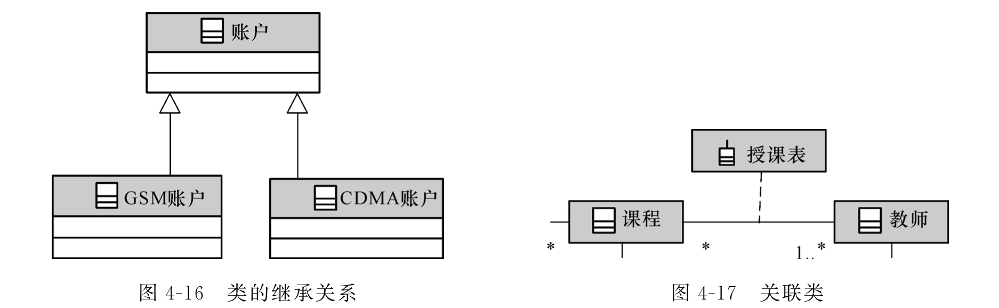

# 软件工程概述

> 软件的定义
>
> 软件的发展和软件危机
>
> 软件工程的概念

程序的定义：程序=算法+数据结构。

**软件的定义**：<u>软件是包括程序、数据及其相关文档的完整集合</u>。程序和数据是构造软件的基础，文档是软件质量的保证，也是保证软件更新及生命周期长短的必需品。

---

软件危机：计算机软件在开发和维护过程中遇到一系列严重问题，导致软件行业的信任危机。具体表现在：

- 软件的开发成本难以估算，无法制定合理的开发计划。
- 用户的需求无法确切表达。
- 软件质量存在问题。
- 软件的可维护性差。
- 缺乏文档资料。

产生软件危机的原因：

- 软件系统本身的复杂性。
- 软件开发的方法和技术不合理不成熟。

---

软件工程定义：运用工程化原则和方法，组织软件开发解决软件危机。

软件工程的三要素：<u>方法、工具、过程</u>。方法提供了“如何做”的技术、工具提供了自动或半自动的软件支撑环境、过程将方法和工具综合起来以达到合理及时地进行计算机软件开发的目的。

**软件工程的目标**：在<u>给定成本和时间</u>的前提下，开发出满足用户需求且具有<u>正确性、可用性</u>等因素的软件产品。

软件工程项目三个基本目标：合理的进度、有限的经费、一定的质量。（和上条类似）

软件工程的终极目标：摆脱手工生产软件的状况，逐步实现软件研制和维护的自动化。

# 生命周期模型

> 软件生命周期概念
>
> 传统软件生命周期模型
>
> 新型软件生命周期模型

软件工程项目三个基本目标：合理的进度、有限的经费、一定的质量。

戴明环：PDCA——Plan，Do，Check，Action。

<u>软件工程过程</u>是为了获得软件产品，在软件工具的支持下由软件工程师完成的一系列软件工程活动。主要活动：

- 软件规格说明：规定软件功能及其使用限制。
- 软件开发：产生满足规格说明的软件。
- 软件确认：通过有效性验证以保证软件能够满足客户要求。
- 软件演进：为了满足客户变更要求，软件在使用过程中不断地改进。

---

软件生命周期概念：软件产品从考虑其概念开始，到该产品不再使用为止的整个时期。包括<u>概念阶段、分析与设计阶段、构造阶段、移交和运行阶段</u>等不同时期。

软件生命周期六个基本步骤：<u>制定计划 P、需求分析 D、设计 D、程序编码 D、测试 C、运行维护 A</u>。

软件过程模型：从一个特定角度提出的对软件过程的概括描述，是对软件开发过程的抽象，包括构成软件过程的各种<u>活动、软件工件、参与角色</u>等。

**软件生命周期模型**：一个框架，描述整个软件生命周期内，软件开发、运行、维护所实施的全部<u>过程、活动、任务</u>。同时<u>描述生命周期不同阶段产生的软件工件（Artifact），明确活动的执行角色</u>等。

## 传统软件生命周期模型

传统模型种类：瀑布模型、演化模型、增量模型、喷泉模型、V&W 模型、螺旋模型、构件组装模型、快速应用开发模型、原型方法。

瀑布模型：<u>**是所有其他软件生命周期模型的基础**</u>。

- 文档驱动，本阶段的工作对象来自于上一阶段活动的输出文档。
- 优点：
  - 降低开发复杂度、提高透明性可管理性。
  - <u>推迟了软件实现，强调必须先分析和设计。</u>
  - 以文档评审等手段指导整个开发过程。
- 缺点：
  - 缺乏灵活性，无法解决需求不明或不准确的问题。
  - 风险控制能力较弱。
  - 文档过多时，增加工作量。文档并不能完全反映实际项目情况，导致错误结论。
- 适用范围：为早期软件开发消除非结构化软件、降低复杂度、促进软件工程化有显著作用。（就是没什么用）

演化模型：

- 提倡两次开发：第一次得到试验性的原型产品，探索可行性，明确需求。第二次在此基础上开发成品。
- 优点：
  - 明确用户需求、提高系统质量、降低开发风险。
- 缺点：
  - 难于管理、结构较差、技术不成熟。
  - 可能会抛弃瀑布模型的文档控制优点。
  - 缺乏设计，可能导致软件系统结构较差。
- 适用范围：需求不清楚、小型系统、开发周期短。

增量模型

- 首先对系统最核心或最清晰的需求进行分析、设计、实现、测试。再按优先级逐步对后续的需求进行上述开发工作。<u>结合了瀑布模型和演化模型的优点。</u>
- 优点：
  - 第一次增量实现系统核心功能，增强客户使用系统的信心。
  - 先开发核心功能，项目总体失败风险较低。
  - 最高优先级的功能先开发，得到最多测试，保障可靠性。
  - 增量在同一体系指导下进行集成，提高稳定性和可维护性。
- 缺点：
  - 难以选择增量粒度。
  - 难以确定所有需求。

喷泉模型（迭代模型）：

- 高情商：各个开发阶段没有特定次序要求，可以并行进行，可以随时补充遗漏的需求（低情商：想到什么做什么，瞎 JB 写）。
- 优点：提高开发效率、缩短开发周期。
- 缺点：难于管理。
- 适用于：需求不明晰。

V 和 W 模型：

- 在瀑布模型基础上改进，把测试活动提前，使得模型能够驾驭风险。

螺旋模型：

- 分为四个象限螺旋上升：制定计划、风险分析、实施工程、客户评价——进入下一回路。
- 适用于：开发周期长、风险高的大型软件。

构件组装模型：

- 模块化思想，使用复用构件库的组件搭建系统。

- 优点：
  - 软件复用、提高效率。
  - 允许多项目同时开发，降低费用、提高可维护性。
- 缺点：
  - 缺乏通用构建组装标准风险较大。
  - 构建可重用性与系统高效性不易协调。
  - 过分依赖构件，构件质量影响产品质量。

快速应用开发模型（RAD）：

- 开发周期 60-90 天，分小组同步进行软件各部分开发。
- 缺点：时间短，需要强沟通配合。不适合所有应用。
- 适用于：信息管理系统的开发。

原型方法：和增量好像也没什么区别。

- 主要用于明确需求。

## 新型软件生命周期模型

RUP 模型：基于瀑布模型演化而来。

- 软件生命周期分解为 4 各阶段：<u>初始阶段、细化阶段、构造阶段、移交阶段</u>。每个阶段结束于一个重要的<u>里程碑</u>。在阶段结尾评估是否满足阶段目标，评估通过允许项目进入下一阶段。
  - 初始阶段：软件目标里程碑。细化阶段：体系结构里程碑。构造阶段：运行能力里程碑。移交阶段：产品发布里程碑。
- 特点：用例驱动，软件体系结构为核心，应用迭代及增量。

XP 极限编程：基于敏捷建模思想，也是瀑布模型演化而来。

- 强调用户满意，开发人员可以对需求的变化作出快速反应。

# 软件需求分析

> 需求分析的对象、任务、目标
>
> 数据、功能、行为建模
>
> 需求类别

## 需求分析的对象、任务、目标

需求分析的必要性：允许开发人员对问题细化并构建分析模型：

- 数据模型：哪些数据进出系统、哪些数据需要存储？
- 功能模型：对数据进行处理的功能有哪些？
- 行为模型：数据进出系统和被系统功能处理的场景。

需求分析的对象：用户要求。

需求分析的任务：准确地定义新系统的目标，<u>回答</u>系统“做什么”的问题，**<u>编写需求规格说明书</u>**（结果）。

需求分析的目标：导出目标系统的逻辑模型，<u>解决</u>目标系统“做什么”的问题。

需求分析的操作性原则：

- 表示和理解问题的**信息域**（数据）。
- 定义软件**功能**。
- 表示软件**行为**。

用户需求说明书与软件需求规格说明书的区别：前者主要采用自然语言来表达用户需求，后者采用规范的建模语言表示。<u>后者是前者的细化，更多地采用计算机语言和图形符号来刻画需求。软件需求规格说明书是软件系统设计的直接依据。</u>

需求规格说明书的内容：需求分析模型。（描述系统需要做什么，而非如何做系统）

- 给出**当前系统及目标系统**的逻辑视图，以及**当前系统**的物理视图。
  - 逻辑模型给出软件要达到的功能和处理数据之间的关系，而非实现细节。
  - 物理模型给出业务环境中的业务实体和业务处理流程，是抽象出当前系统逻辑模型的基础。

~~常用的建模分析方法有：SA（面向数据流的结构化分析方法）、JSD（面向数据结构的 Jackson 方法）、OOA（面向对象的分析方法）等。~~

## 数据、功能、行为建模

数据模型：信息和内容关系、信息流、信息结构。

功能模型：对进入软件的信息和数据进行变换的模块，必须至少完成“输入、处理、输出”三个功能。

行为模型：大多数软件对来自外界的事件做出反应。行为模型创建了软件状态的表示，以及导致软件状态变化的事件的表示（状态机）。

## 需求类别

**功能需求**：列举出所开发软甲你在功能上应做什么（最主要需求）。

**性能需求**：给出所开发软件的技术性能指标。系统的实时性和其他时间要求（响应时间、处理时间、消息传送时间等）、资源配置要求、精确度、数据处理量等其他要求。

**环境需求**：软件系统运行时所处环境的要求。① 硬件方面，采用什么机型、有什么外部设备、数据通信接口等。② 软件方面，采用什么支操作系统、数据库管理系统等。③ 使用方面，需要使用部门在制度上、人员技术水平上具备什么样的条件等。

其他需求类别：

- 可靠性需求：软件的有效性和数据完整性。
- 安全保密需求。
- 用户界面需求。
- 资源使用需求：指所开发软件运行时所需的数据、软件、内存空间等各项资源。以及软件开发时的人力物力需求。
- 软件成本消耗与开发进度需求：软件项目立项之后，根据合同规定，对软件开发的进度和步骤费用提出要求，作为开发管理依据。
- 预估将来系统可能达到的目标：在开发过程中对系统将来可能的扩充与修改做准备。

# 面向对象分析

> 领域建模
>
> 用例建模

面向对象的需求分析建模：领域模型和用例模型。

- 领域模型表示需求分析阶段“当前系统”逻辑模型的静态结构及业务流程。
- 用例模型是“目标系统”的逻辑模型，定义了目标系统“做什么”的需求。由用例图、用例说明、系统顺序图 SSD、操作契约 Operation Contract 四部分组成。

## UML 概念及画法

UML：面向对象的统一<u>建模</u>语言。是一种<u>建模语言规格说明</u>，是一种表示的标准。不是过程也不是方法，但允许任何一种过程和方法使用它。

4+1 视图：从不同视角为系统架构建模，形成系统的不同视图。分别为：

- 用例视图（用户模型视图、场景视图）：强调从用户角度看到的或需要的系统功能。
- 逻辑视图（结构模型视图、静态视图）：展现系统的静态或结构组成及特征。
- 进程试图（行为模型视图、过程视图、协作视图、动态视图）：描述设计的并发和同步等特性，关注系统非功能性需求。
- 构件视图（实现模型视图、开发视图）：关注代码的静态组织与管理。
- 部署视图（环境模型视图、物理视图）：描述硬件的拓扑结构以及软件和硬件的映射问题，关注系统非功能性需求（性能、可靠性等）。

UML 的 9 个基本图：

- <u>用例图 Use Case Diagram：从用户的角度描述系统的功能。</u>
- <u>类图 Class Diagram：描述系统的静态结构（类及其相互关系）。</u>
- 对象图：描述系统在某个时刻的静态结构（对象及其相互关系）。
- <u>顺序图 Sequence Diagram：按时间顺序描述系统元素间的交互。</u>
- <u>协作图 Collaboration Diagram：按照时间空间的顺序描述系统元素间的交互和他们之间的关系。</u>
- 状态图：描述系统元素（对象）的状态条件和响应。
- 活动图：描述了系统元素之间的活动。
- 构件图：描述了实现系统的元素（类或包）组织。
- 部署图：描述了环境元素的配置并把实现系统的元素映射到配置上。

UML 视图与图的关系：

- 用例视图——用例图。
- 逻辑视图——类图、对象图、顺序图/协作图。
- 进程试图——状态图、活动图。
- 构件视图——构件图。
- 部署视图——部署图。

UML 图的画法：

- 类的基本结构：类名+属性+操作()。
  - 构建领域模型时，不需要操作()。

- 类之间的关系：

## 领域模型

领域模型：领域内**概念类**或**对象**的抽象可视化表示（将客观世界中的事物可视化抽象化）。主要用于概括地描述**业务背景**和重要的**业务流程**，通过类图和活动图展示。

- 业务背景：描述概念类之间的关系，表示成能够代表业务知识结构的<u>类图</u>。
- 业务流程：由角色及其执行的活动构成。由<u>活动图</u>描述。

创建领域模型的步骤：

1.  找出当前需求中的<u>候选概念类</u>。
2.  在领域模型中描述这些<u>概念类</u>。用问题域中的词汇对概念类命名，将与当前需求无关的概念类排除。
3.  在概念类之间<u>添加必要的关联</u>来记录关系。用关联、继承、组合/聚合表示。
4.  在概念类中<u>添加</u>用来实现需求必要的<u>属性</u>。

识别概念类或属性：

- 属性一般是可以赋值的（如数字、文本），而概念类不可以。
- 如果对一个名词是概念类还是属性不确定，将其作为概念类处理。
- 不存在名词到类的映射机制，因为自然语言具有二义性。

领域模型示例：

## 用例模型

用例模型是“目标系统”的逻辑模型，定义了目标系统“做什么”的需求。由四部分组成：

- 用例图
- 用例说明
- 系统顺序图 SSD
- 操作契约 Operation Contract

---

用例图：由三个基本元素组成。

- Actor：称为角色或参与者，使用系统的对象（不一定是人）。
- Usecase：用例，描述<u>角色如何使用系统功能实现需求目标</u>的一组成功场景和一系列失败场景的集合。
- Association：角色和用例之间的关系、用例和子用例之间的关系。

用例图示例：

---

系统顺序图 SSD：确定角色与系统之间的交互关系，以代码风格命名。包含：

- 角色。
- 代表软件系统的对象，一般使用 system 或系统命名。
- 角色与 system 之间的交互信息，简称消息或操作。

SSD 示例：

---

操作契约：为系统操作定义。领域模型中业务对象接收到系统事件后，执行必须的业务处理时各业务对象的状态以及系统操作执行的结果。

操作契约示例：

# 结构化需求分析方法

> 数据建模
>
> 功能建模
>
> 行为建模
