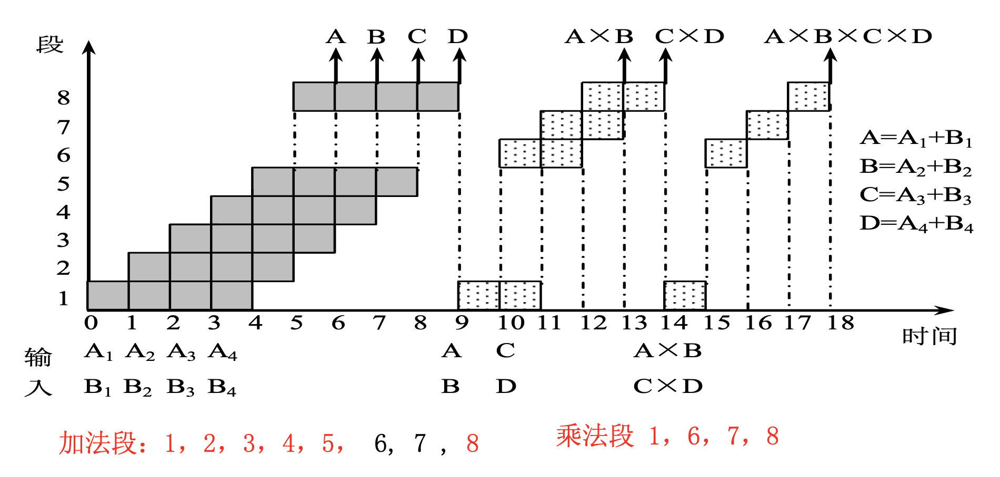

<h1 align="center"> 计算机系统结构</h1>

# 第一章基础知识

> 系统结构的相关概念
>
> - 计算机系统层次结构
> - 计算机系统结构基本概念（广义机器、透明性、编译）
> - 计算机系统结构、组织、实现的定义
> - 计算机系统分类方法/Flynn 分类法
>
> 基本原理和性能公式
>
> - 大概率事件优先
> - Amdahl 定律
> - 程序的局部性原理
> - CPU 性能计算
> - <u>加速比公式应用</u>
>
> 性能评价标准
>
> - <u>性能指标</u>（CPU 时间、<u>CPI</u>、MIPS、MFLOPS）

## 计算机系统结构相关概念

计算机系统的层次结构：计算机是由硬件、软件、固件（固化的微程序）组成的复杂系统，按机器语言功能划分为多级层次结构。

下面两级（微程序级、传统机器语言机器级）使用硬件/固件实现，称为<u>物理机</u>。上面四级由软件实现，称为<u>虚拟机</u>。第二级（传统机器语言级）是软硬件界面。

| 层数 | 语言             | 实现                                                   |
| ---- | ---------------- | ------------------------------------------------------ |
| 0    | 布尔语言（硬件） |                                                        |
| 1    | 微程序指令       | 用微指令集编写微程序，固件、硬件来解释                 |
| 2    | 传统机器语言     | 传统机器语言程序有 L1 级微程序或 L0 级硬联逻辑进行解释 |
| 3    | 操作系统         | 包括传统机器及操作系统级指令，由微程序解释             |
| 4    | 汇编语言         | 翻译成 L3 和 L2 级语言执行                             |
| 5    | 高级语言         | 通过编译程序翻译到 L4 或 L3 级，或通过解释方法实现     |
| 6    | 应用语言         | 由应用程序包翻译到 L5                                  |

翻译和解释：一般情况，上述六级层次的 L1-L3 用解释实现，而 L4-L6 用翻译实现。

- 翻译：用转换程序把高一级机器上的程序转换为低一级机器上的等效程序，然后再在这低一级机器上运行。速度快、占用空间大。
- 解释：对于高一级机器上程序中的每一条语句或指令，转换为低级语言的一段等效程序执行，执行完后再去高一级机器取下一条语句或指令。速度慢、占用空间小。

计算机系统结构的定义：

- 计算机系统结构是指传统机器程序员所看到的计算机属性，即概念性结构与功能特性。
- 计算机系统结构的实质：<u>确定计算机系统中软硬件的界面</u>，界面之上是软件实现的功能，界面之下是硬件和固件实现的功能。
- <u>透明性</u>：一种本来存在的事物或属性，从某种角度看好像不存在或看不到。低层机器的属性对高层机器程序员来说通常是透明的。
- <u>广义系统结构定义</u>：包括指令系统结构、组成、硬件。

计算机系统结构、组成、实现：

- <u>计算机体系结构</u>：数据表示、寻址规则、寄存器定义、指令集、终端系统、机器工作状态的定义和切换、存储体系、信息保护、I/O 结构等。

- <u>计算机组成</u>：计算机系统结构的逻辑实现，包含物理机器级中的数据流和控制流的组成以及逻辑设计等。着眼于：物理机器级内各事件的排序方式与控制方式、各部件的功能以及各部件之间的联系。<u>具有相同系统结构的计算机可以采用不同的计算机组成。</u>

- <u>计算机实现</u>：计算机组成的物理实现。着眼于：器件技术、微组装技术。<u>同一种计算机组成又可以采用多种不同的计算机实现。</u>

  > 例：
  >
  > - 机器指令集的确定、主存容量与编址方式等属于计算机体系结构。
  > - 指令实现方式（取指令、去操作数、运算、送结果等的具体操作及排序方式）、主存速度与逻辑结构（多体交叉存储）等属于计算机组织（计算机组成）。
  > - 实现指令集中所有指令功能的具体电路、器件的设计、装配技术，存储器器件和逻辑电路的设计等属于计算机实现。

计算机系统分类方法/Flynn 分类法：

- Flynn 分类法：按照指令流和数据流的多倍性分类。

  - 指令流：计算机执行的指令序列
  - 数据流：由指令流调用的数据序列
  - 多倍性：在系统**最受限**的部件上，同时处于统一执行阶段的指令或数据的最大数目

  分为 SISD（传统顺序处理计算机）、SIMD（阵列处理机）、MISD（不存在）、MIMD（多处理机）系统。

  

- Handler 分类法：把硬件结构分为三个层次，根据并行度和流水线分类。

  $T=<k\times k', d \times d', w \times w'>$

  k：控制器数目，k'：控制器流水线中控制部件的数目

  d：PCU 控制的 ALU 或 PE 数目，d'：指令流水线中 ALU 部件的数目

  w：ALU 或 PE 的字长，w'：操作流水线中基本逻辑线路数目

- 冯氏分类法：用最大并行度$P_m$（单位时间内能够处理的最大二进制位数）分类。

  - 字串位串 WSBS：纯串行处理机
  - 字串位并 WSBP：传统单处理机
  - 字并位串 WPBS：同时处理多个字的同一位
  - 字并位并 WPBP：同时处理多个字的多个位

  平均并行度：$P_a = \frac{\sum_{i=1}^T P_i}{T}$

  T 个周期内的平均利用率：$\mu = \frac{P_a}{P_m}$

  > CRAY-1 计算机有 1 个 CPU，12 个相当于 ALU 或 PE 的处理部件，最多可以实现 8 级流水线。字长为 64 位，可以实现 1 ～ 14 位流水线处理。所以 CRAY-1 的体系结构可表示为： T(CRAY-1)=〈1×1，12×8，64×(1 ～ 14)〉。

系统结构的发展：

- 冯诺依曼结构：输入设备、输出设备、控制器、运算器、存储器。指令与数据同等对待（一条总线）。
- 哈佛结构：冯诺依曼基础上，指令与数据分离。现代计算机都是哈佛结构。

## 基本原理和性能公式

大概率事件优先原理： 优先加速使用频率高的部件。是**最重要和最广泛采用的计算机设计准则**。

程序的局部性原理：

- 时间局部性：程序即将用到的信息很可能就是目前正在使用的信息。（经验规则：程序执行时间 90%都是在执行程序中 10%的代码）
- 空间局部性：程序即将用到的信息很可能与正在使用的信息在空间上临近。

Amdahl 定律：系统性能加速比与该部件在系统中的总执行时间有关。

- $加速比S_n=\frac{改进后性能}{改进前性能}=\frac{改进前用时}{改进后用时}$

- $S_n = \frac{T_0}{T_n} = \frac{1}{(1-F_e)+\frac{F_e}{S_e}}$，$S_e$为部件加速比。

  > 某计算机系统采用浮点运算部件后，使浮点运算速度提高到原来的 25 倍，而系统运行某一程序的整体性能提高到原来的 4 倍，试计算该程序中浮点操作所占的比例。
  >
  > 由题可知： Se = 25 Sn = 4。根据加速比可得：$4=\frac{1}{(1-F_e)+\frac{F_e}{25}}$，得 Fe=78.1%

CPU 性能公式：

- CPU 时间：执行一个程序所需 CPU 时间。

  - $CPU_{时间}=IC \times CPI \times 时钟周期时间$。时钟周期时间$t = 1/f(系统时钟频率)$。
  - $CPU_{时间}=\sum\limits_{i=1}^n (CPI_i \times IC_i)$。

- CPI：一条指令的平均时钟周期数，$CPI=执行程序所需的时钟周期数 \div IC(执行程序的指令条数)$

- CPU 性能取决于三个参数：

  - t：取决于硬件实现技术和计算机组成
  - CPI：取决于计算机组成和指令系统的结构
  - IC：取决于指令系统的结构和编译技术

  > 假设 FP 指令的比例为 25%，其中，FPSQR 占全部指令的比例为 2%，FP 操作的 CPI 为 4，FPSQR 操作的 CPI 为 20 ，其他指令的平均 CPI 为 1.33。现有两种改进方案，第一种是把 FPSQR 操作的 CPI 减至 2，第二种是把所有的 FP 操作的 CPI 减至 2，比较两种方案对系统性能的提高程度。
  >
  > 解：改进前，指令的平均时钟周期 CPI 为： $4 \times 0.25 + 1.33 \times 0.75 = 2$
  >
  > 第一种方案：CPI 改进了$(20-2) \times 0.02 = 0.36$
  >
  > 第二种方案：CPI 改进了$(4-2) \times 0.25 = 0.5$
  >
  > 第二种方案的改进较大。

## 性能评价标准

评价方法：CPU 时间、<u>CPI</u>、MIPS、MFLOPS。

比较若干测试程序在不同机器上的执行时间：

- 平均执行时间：各程序执行时间的算术平均值。
- 加权执行时间：各程序执行时间的加权平均值。
- 调和平均值法：执行任务数量$\div$总耗时（速度不可简单相加）。$H_m = \frac{n}{\sum_{i=1}^n T_i}$
- 几何平均值法：执行速度的几何均值。$G_m = \sqrt[n]{\prod_{i=1}^n R_i}$

# 第三章流水线

> 流水线的基本概念及分类：静、动态流水线；单、多流水线；线性、非线性流水线
>
> 流水线表示：<u>时空图、连接图</u>
>
> <u>流水线性能计算和分析</u>：吞吐率、加速比、效率
>
> 多功能/静态动态流水线的时空图
>
> 流水线相关与冲突：
>
> - 经典五段流水线：<u>各段完成的操作</u>
>
>   - <u>数据相关（真相关）、名相关、控制相关</u>
>   - <u>结构冲突、数据冲突、控制冲突</u>
>   - 数据冲突的各种形式（RAW、WAR、WAW 等）
>
> - <u>减少数据冲突的方法：延迟、定向、编译</u>
>
> - <u>解决控制冲突的方法：排空、预测、延迟分支、编译</u>

## 流水线基本概念及分类

流水线技术主要思想是把一个复杂任务分解为若干个子任务。每个子任务由专门功能部件完成，并使多个子任务并行执行。

流水线技术的核心：部件功能专用化。（一件工作按功能分隔为若干相互联系的部分，每一部分指定给专门部件（段）完成，各部件（段）执行过程时间重叠，所有部件依次序分工完成工作。）

流水线的级：流水线中每个子过程及其功能部件，称为一个流水段。流水线的段数称为流水线深度（长度）。

- 操作部件采用流水线，称为操作部件流水线。
- 指令执行过程采用流水线，称为指令流水线。
- 访问主存部件采用流水线，称为访存部件流水线。
- 多计算机通过存储器连接构成流水线，称为宏流水线。

流水线的分类 1：

- 部件级流水线（运算操作流水线）：各类型的运算操作按流水方式进行。
- 处理级流水线（指令流水线）：把一条指令的执行过程分段，按流水方式执行。
- 系统级流水线（宏流水线）：把多台处理机串行连接起来，每个处理机完成整个任务中的一部分。

流水线的分类 2：

- 单功能流水线：只能完成固定功能。
- 多功能流水线：流水线的各段可以进行不同连接，实现不同功能。

流水线的分类 3：

- 静态流水线：同一时间内，多功能流水线中的各段只能按同一种功能的连接方式进行工作。
- 动态流水线：同一时间内，多功能流水线中的各段可以按照不同方式连接，同时执行多种功能。（而不需等到排空之后重新装入）

流水线的分类 4：

- 线性流水线：流水线各段串行连接，每个段最多流过一次。
- 非线性流水线：流水线中有反馈回路，每个段可以流过多次。

流水线的分类 5：

- 顺序流水线：流水线输出的任务顺序与输入的任务顺序相同。
- 乱序流水线：流水线输出的任务顺序与输入的顺序**可以不同**。（也称无序、错序、异步流水线）

典型的指令流水线：

- 三段：取指、分析、执行
- 四段：取指（访问主存取出指令并送到指令寄存器）、译码（形成操作数地址并读取操作数）、执行（完成指令的功能）、存结果（将运算结果写回寄存器或主存）

流水线通过时间和排空时间：

- 通过时间：第一个任务**从**进入流水线**到**流出结果所需的时间，又称装入时间

- 排空时间：最后一个任务从进入流水线到流出结果所需的时间

  在装入和排空的过程中，流水线不满载。

指令通过流水线时间最长的段称为**流水线瓶颈**。

每段流水线后面有一个**缓冲寄存器**，称为**流水寄存器**。有**缓冲、隔离、同步**作用。

## 流水线性能计算和分析

> 吞吐率、加速比、效率、最佳段数。

吞吐率 TP：单位时间内流水线完成的任务数量或输出结果的数量。$TP = \frac{n}{T}$

- 各段时间相等的流水线：理想的 k 段线性流水线完成 n 个连续任务的时间：$T_k = (k+n-1) \Delta t$

  实际吞吐率：$\frac{n}{(k+n-1) \Delta t}$

  最大吞吐率：$TP_{max}=\lim\limits_{n \to \infty} \frac{n}{(k+n-1) \Delta t} = \frac{1}{\Delta t}$

- 各段时间不等的流水线：时间最长段称为流水线的瓶颈$T_k = \sum\limits_{i=1}^k \Delta t_i + (n-1) \max (\Delta t_1,\Delta t_2,···,\Delta t_k)$

加速比 S：完成同样任务，不使用流水线所用时间与使用流水线所用时间之比。$S=\frac{T_s}{T_k}$

- 各段时间相等的 k 段流水线：$S = \frac{n \times k \Delta t}{(k+n-1) \Delta t}$

  最大加速比：k

- 各段时间不等的流水线：$S = \frac{n \sum\limits_{i=1}^k \Delta t_i}{\sum\limits_{i=1}^k \Delta t_i + (n-1) \max (\Delta t_1,\Delta t_2,···,\Delta t_k)}$

效率 E：流水线中的设备实际使用时间与整个运行时间的比值，又称流水线设备利用率。

- 连续完成 n 个任务，每段的效率计算：每段都执行了 n 个任务，用时$n \Delta t$，效率$e = \frac{n \Delta t}{(k+n-1) \Delta t}$
- 整条流水线的效率$E = \frac{e_1+e_2+...+e_k}{k}= \frac{n}{k+n-1}$

TP、S、E 关系：

- $E=P \times \Delta t$、$E = \frac{S}{k}$

解决流水线瓶颈的方法：

- 重复设置瓶颈段：让多个瓶颈流水段并行工作。
- 瓶颈段再细分：细分为多个子流水段（每个子流水段用时和非瓶颈段相同），形成超流水线。

流水线的最佳段数：流水线段数增加，吞吐率、加速比和价格均提高。

- PCR 定义为单位价格的最大吞吐率。
- $PCR = \frac{P_{max}}{C}$，其中$P_{max} = \frac{1}{\frac{t}{k}+d}$，$C = \frac{1}{a+b \times k}$。t 为非流水机器串行完成一个任务的时间，d 为锁存器延迟，a 为流水段本身价格，b 为锁存器价格。
- 对 k 求导可得 PCR 极大值，以及对应的最佳段数$k_0$。$k_0 = \sqrt{\frac{t \times a}{d \times b}}$
- 大于等于 8 段的流水线称为超流水线。

## 流水线例题

解：是静态流水线，不能动态切换流水线功能。因此应算完全部加法再算乘法。

## 流水线相关与冲突（五段流水线）

经典五段流水线：分为 IF、ID、EX、MEM、WB 五个周期。

- IF：以程序计数器 PC 中的内容作为地址，从存储器中取出指令并放入指令寄存器 IR。PC 指向顺序的下一条指令。
- ID：指令译码，用 IR 中的寄存器地址去访问通用寄存器组，读出所需操作数。
- EX：
  - load 和 store 指令：ALU 把指定寄存器的内容与偏移量相加，形成访存有效地址。
  - ALU 指令：ALU 对从通用寄存器组读出的数据进行运算。
  - 分支指令：ALU 把偏移量与 PC 值相加，形成转移目标的地址。同时，判断分支是否成功。
- MEM：
  - load 和 store 指令：根据有效地址从存储器读出相应数据，或把指定数据写入有效地址指向的存储单元。
  - 分支指令：如果分支成功，就把在前一个周期中计算好的转移目标地址送入 PC。分支指令执行完成。否则，不进行任何操作。
  - ALU 指令此周期不进行操作。
- WB：把结果写入通用寄存器组。对于 ALU 指令，结果来组 ALU。对于 load 指令，结果来自存储器。

相关与流水线冲突：

- 相关：两条指令之间存在某种依赖关系，以至于他们可能无法在流水线中重叠执行，或只能部分重叠。

  相关有三种类型：数据相关（真相关）、名相关、控制相关。

  - 数据相关：下述条件之一成立，则称指令之间数据相关。

    - 指令 a 使用指令 b 产生的结果。
    - 指令 a 与指令 b 数据相关，而指令 b 与指令 c 数据相关。

    第二个条件表明数据相关具有传递性。

  - 名相关：名指指令访问的寄存器或存储器的名称。两条指令使用了相同的名，但并没有数据流动关系，则称为名相关。

    - 反相关：指令 b 写的名与指令 a 读的名相同。反相关指令之间的执行顺序必须严格遵守，保证 b 读的值是正确的。
    - 输出相关：指令 b 与指令 a 写的名相同。输出相关指令的执行顺序也必须严格遵守，保证最后的结果是指令 b 写进去的。

    名相关的两条指令之间没有数据的传送，只是恰巧用了相同的名。可以通过**换名技术**（改变指令中操作数的名）消除名相关。对于寄存器操作数换名称为**寄存器换名**。寄存器换名既可以通过编译器静态实现，也可以硬件动态完成。

  - 控制相关：分支指令和其它<u>会改变 PC 值的指令</u>引起的相关。需要根据分支指令的执行结果来确定后面该执行哪个分支上的指令。

- 流水线冲突：对于具体的流水线，由于相关的存在，指令流中的下一条指令不能在指定的时钟周期开始执行。有三种类型，<u>结构冲突、数据冲突、控制冲突。</u>约定：当一条指令被暂停时，在该指令之后流出的所有指令都要被暂停，而之前流出的指令仍继续进行。

  - 结构冲突：某种指令组合因为硬件资源冲突而不能正常执行，称具有结构冲突。功能部件不是完全流水或硬件资源份数不够时发生。解决方法：插入暂停周期，或增加 Cache 等硬件资源。

  - 数据冲突：相关的指令靠得足够近，他们在流水线中的重叠执行或重新排序会改变指令读/写操作数的顺序，使结果错误，谓数据冲突。

    - 写后读冲突（RAW、WR）：对应真数据相关。
    - 写后写冲突（WAW、WW）：对应输出相关。写后写冲突仅发生在“不止一个段可以进行写操作，或指令被重新排序”的流水线中。前述五段流水线不发生 WAW 冲突。
    - 读后写冲突（WAR、RW）：对应反相关。读后写冲突仅发生在“有些指令的写结果操作被提前、有些指令的读操作被滞后，或指令被重新排序”的流水线中。前述五段流水线不发生 WAR 冲突。

    使用<u>定向技术</u>（旁路技术）减少数据冲突引起的停顿：将计算结果从其产生的地方（ALU 出口）直接送到其他指令需要它的地方（ALU 的入口），可以避免停顿。

    需要停顿的数据冲突：对于无法通过定向技术解决的数据冲突，需要设置一个“流水线互锁机制”的功能部件保证指令正确执行。其作用是检测和发现数据冲突，并使流水线停顿（stall）直至冲突消失。

    依靠编译器解决数据冲突：在编译时让编译器重新组织指令顺序来消除冲突。称为**指令调度**或**流水线调度**。

  - 控制冲突：分支指令和其它<u>会改变 PC 值的指令</u>引起的冲突。处理分支指令最简单的方法是“冻结”“排空”流水线，在 ID 段检测到分支指令时，立即暂停流水线输入，进行 EX、MEM，确定是否分支成功并计算出新的 PC 值，这样带来 3 个时钟周期的延迟。だめ。

    为了减少**分支延迟**，可以采取：① 尽早判断出（或猜测）分支转移是否成功。② 尽早计算出分支目标地址。<u>通过编译器减少分支延迟的方法：</u>

    - 预测分支失败：在检测到分支指令之后，沿分支失败的分支继续处理指令。当确定分支是失败时（预测分支失败成功），流水线正常流动。否则（预测分支失败失败），把在分支指令之后取出的指令转化为空操作，按分支目标地址重新取指执行。

    - 预测分支成功：没用。除非已知分支目标地址。

    - 延迟分支：把无论是否分支成功都必须执行的指令，紧接着分支指令执行（放入延迟槽），延迟槽中的指令替换了原本必须插入的暂停周期。绝大多数延迟槽仅容纳一条指令。

      延迟槽指令的调度方法三种：

      - 从前调度：从分支指令之前找一条指令插入延迟槽。被调度的指令必须与分支无关，适合任何情况。
      - 从目标处调度：分支成功时起作用。分支成功概率高时采用。
      - 从失败处调度：分支失败时起作用。不能从前调度时可用。

> 条件转移分支指令通常要在 MEM 段末尾才会使 PC 内容发生改变。对于 k 级流水线，需停顿 k-1 个时钟，直到 PC 中生成新地址后，才能取出下一条指令。
>
> 最坏情况：分支指令占比为 p，预测分支失败，分支转移成功的概率为 q。k 段流水线执行 n 条指令，最坏需要多停顿$pqn(k-1) \Delta t$时间。流水线最大吞吐率为$\lim\limits_{n \to \infty} \frac{n}{(k+n-1) \Delta t + pqn(k-1) \Delta t}= \frac{1}{[1+pq(k-1)] \Delta t}$。（若没有分支指令最大吞吐率为$\frac{1}{\Delta t}$）

# 第五章指令级并行及其开发

> 指令集并行基础概念
>
> 指令的动态调度技术（硬件方法）：
>
> - 乱序执行调度的概念
> - <u>记分牌算法</u>
> - <u>Tomasulo 算法</u>
> - 基于硬件的前瞻执行
>
> 动态分支预测技术：
>
> - <u>分支历史表 BHT</u>
> - <u>分支目标缓冲器 BTB</u>
>
> 多流出技术：超标量、超流水、VLIW、静态指令调度

## 指令集并行基础概念

**指令集并行（ILP）**是指令间存在的一种并行性，使计算机可以并行执行两条及以上的指令。

<u>开发 ILP 的途径：① 资源重复（重复设置多个部件同时执行多条指令）② 采用流水线技术使指令重叠并行执行。</u>

开发 ILP 的方法：分为硬件方法和软件方法。本章为硬件方法。

流水线处理机的实际 CPI：$CPI_{流水线} = CPI_{理想}+停顿_{结构冲突}+停顿_{数据冲突}+停顿_{控制冲突}$。减少停顿以提高降低 CPI、提高 IPC。

<u>基本程序块</u>：一串连续的代码除了入口和出口之外，没有其他的分支指令和转入点，称为一个**基本程序块**。

循环并行性：循环的不同迭代之间存在的并行性。本章不讨论。

相关与指令级并行（概念）：

- 程序顺序：由原来程序确定的在完全串行方式下指令的执行顺序。我们需要尽可能地开发并行性，只有在可能导致错误的情况下，才保持程序顺序。
- 保持异常行为：无论怎么改变指令的执行顺序，都不能改变程序中异常的发生情况。实际使用中：指令执行顺序的改变不导致程序中发生新的异常。
- 数据流：数据值从其产生者指令，到其消费者指令的实际流动。分支指令使得数据流有动态性，分支指令的执行结果决定哪条指令才是所需数据的产生者。 之后讨论的**前瞻执行**不仅解决异常问题，还能在保持数据流的情况下减少控制相关对开发 ILP 的影响。

## 指令的动态调度技术（硬件方法）

**静态调度**在编译期间，把相关的指令拉开距离来减少可能产生的停顿。

**动态调度**能在保持数据流和异常行为的情况下，通过硬件对指令执行顺序重排，减少数据相关导致的停顿：

- 优点：① 能处理编译时情况不明的相关（如存储器访问相关），并简化编译器。② 使同一段代码能在不同流水线上高效地执行。
- 代价：硬件复杂性显著增加。

动态调度基本思想：

- 将流水线的 ID 段分为“IS 流出”、“RO 读操作数”两个阶段。这样使得指令**乱序执行**，指令的完成也是**乱序完成**。
- 乱序执行带来新问题：
  - RW 冲突和 WW 冲突。
  - 异常处理复杂化。**不精确异常**：异常时处理机现场与严格按程序顺序执行时现场不同。不精确异常使得异常处理后难以继续执行原有程序。产生不精确异常的原因：当指令 a 导致异常发生时，流水线已经执行程序顺序是 a 之后的指令，还没完成程序顺序是 a 之前的指令。

典型动态调度算法：**记分牌算法、Tomasulo 算法**。主要考虑的因素：资源（结构）利用效率、三种数据相关。

### 记分牌算法

<u>记分牌的目标：尽早执行没有结构冲突和数据冲突的指令。</u>

指令执行的步骤：每条指令的执行过程分为 4 段——IS 流出、RO 读操作数、EX 执行、WB 写结果。（主要考虑浮点操作，运算在浮点寄存器之间进行，不涉及 MEM 段）

- 流出：若流出指令所需的功能部件空闲，并且所有其他执行中的指令的目的寄存器与该指令不同，记分牌就向功能部件流出该指令，并修改记分牌内部的记录表。如果存在结构相关或 WAW 冲突，则该指令不流出。（<u>在流出段解决了 WAW 冲突</u>）
- 读操作数：记分牌检测源操作数的可用性。一旦数据可用，它就通知功能部件从寄存器中读出源操作数并开始执行。否则就等待写完成之后再读出（锁定）（<u>读操作数段动态地解决了 RAW 冲突，并可能导致指令乱序执行</u>）
- 执行：取到操作数后，功能部件开始执行。结果产生后，通知记分牌它已完成执行。这一步相当于五段流水线中的 EX。但在浮点流水线中，<u>这一段可能占用多个时钟周期</u>。其他指令如果不与<u>正在执行或被锁定</u>指令相关，可提前执行或完成。
- 写结果：记分牌知道执行部件完成执行后，检测是否存在 WAR 冲突（前面某条指令的源操作数寄存器，是本指令的目标寄存器）。如果不存在（或已有的 WAR 冲突已消失），记分牌就通知功能部件把结果写入目的寄存器，并释放该指令执行所用的所有资源。否则必须等待。这一步对应五段流水线的 WB。

记分牌记录信息的组成：

- 指令状态表：记录正在执行的各条指令已经进入哪一段。
- 功能部件状态表：记录各个功能部件的状态。每个功能部件有 1 项，每项由 9 个字段组成。
  - Busy：忙标志，功能部件是否正忙。
  - Op：正在或将要执行的操作。
  - $F_i$：目的寄存器编号，$F_j,F_k$：源寄存器编号。（按指令中的顺序排列）
  - $Q_j,Q_k$：向源寄存器$F_j,F_k$写数据的功能部件。
  - $R_j,R_k$：源寄存器标志位，“yes”表示$F_j/F_k$的操作数**<u>可用——就绪且未被取走（产生且未读）</u>**。否则“no”。
- 结果寄存器状态表：每个寄存器在该表中有一项，用于指出哪个功能部件（编号）将把结果写入该寄存器。如果正运行的指令全都不以它为目的寄存器，则设置为“no”或 0。

记分牌算法的冲突分析：

- WW 冲突会导致记分牌在流出阶段停顿。

- RW 冲突会导致记分牌在写结果阶段停顿。

- 真相关引起的 WR 冲突会导致记分牌在读操作数阶段停顿。

- 资源冲突会导致记分牌在流出阶段停顿。

  通过记分牌，避免了 WW、WR、RW 冲突及结构冲突。

### Tomasulo 算法

又称公共数据总线法。通过<u>分散控制</u>，处理数据相关和乱序执行。

基于 Tomasulo 算法的 MIPS 处理器浮点部件主要结构：

- 指令队列：存放部件送来的指令，FIFO、顺序流出。
- 保留站：保存流出到本功能部件执行的指令信息（包括操作码、操作数、解决冲突的信息）。每个保留站有一个标识字段，唯一地标识了该保留站。
- 访存部件缓冲器：load 缓冲器和 store 缓冲器存放读/写存储器的数据或地址（类似保留站）。
- 公共数据总线 CDB：重要的数据通路。所有计算结果都送到 CDB，它直接播送到各个需要的地方。多个执行部件且采用多流出的流水线中有多条 CDB。计算结果先送到 CDB 再传送到功能部件，不需要经过寄存器。
- 浮点寄存器 FP：通过总线连接到各功能部件，通过 CDB 连接到 store 缓冲器。
- 运算部件：浮点加法器和浮点乘法器。

核心思想：

- 记录和检测指令相关，把发生 WR 冲突的可能性减到最小。
- 通过<u>寄存器换名</u>技术消除 RW 冲突和 WW 冲突：寄存器换名通过保留站和流出逻辑共同完成。当指令流出时，如果其操作数还没有计算出来，则将该指令中相应的寄存器号换名为将产生这个操作数的保留站的标识。当指令流出到保留站之后，其操作数寄存器号要么换成了数据本身（已就绪状态），要么换成了保留站标识，而不再与寄存器相关。这样消除了 WAR 冲突。

指令执行的步骤：三步。

- 流出：从指令队列头部取指。如果该指令操作所要求的的保留站有空闲的，则把该指令送到该空闲保留站（设为 r）。如果操作数未就绪，则进行寄存器换名。另外，进行目的寄存器预约，将其设置为接收保留站 r 的结果（相当于提前完成了写操作）。由于指令顺序流出，同一个结果寄存器的预约结果肯定是最后一条指令的，消除了 WAW 冲突。如果没有空闲保留站，指令不能留出（发生结构冲突）。
- 执行：如果某个操作数未被计算出来，保留站监视 CDB，结果产生保留站立刻从 CDB 获取数据。操作数都就绪后保留站用相应的功能部件开始执行指令操作。（靠推迟执行的方法解决 RAW 冲突）load 指令执行条件是存储器部件就绪，而 store 指令执行的条件是要存入存储器的数据到达并且存储器部件就绪。
- 写结果：功能部件计算完毕后将结果放到 CDB 上，等待该结果的寄存器和保留站同时从 CDB 获取数据。

保留站字段：

- Op：对源操作数进行的操作。
- $Q_j,Q_k$：将产生源操作数的保留站号。0 表示操作数已就绪且在$V_j/V_k$中，或者不需要操作数。
- $V_j,V_k$：源操作数的值，如`Reg[F4]​`。对于每一个操作数来说，V 或 Q 字段只有一个有效。
- Busy：“yes”表示本保留站或缓冲单元正忙。
- A：仅 load 和 store 缓冲器有该字段。开始先存放指令中的立即数字段，地址计算后存放有效地址。

Tomasulo 算法的优点：

- 冲突检测逻辑和指令执行控制是分布的（通过保留站和 CDB 实现）。
- 通过寄存器换名和预约，消除了 WW 冲突和 RW 冲突导致的停顿。
- 通过延迟执行解决 WR 冲突。
- 保留站、寄存器组均有附加信息，用于检测和消除冲突。

## 动态分支预测技术

开发的 ILP 越多，控制相关的制约就越大：① 在 n 流出（每个时钟周期流出 n 条指令）处理机中，遇到分支指令的可能性增加 n 倍。② 根据 Amdahl 定律，机器 CPI 越小，控制停顿的相对影响越大。

动态分支预测技术目的：① 预测分支是否成功。② 尽快找到分支目标地址或指令。

动态分支预测技术需要解决的问题：① 如何记录分支的历史信息。② 如何根据这些信息预测分支去向，甚至提前取出分支目标指令。

### 分支历史表 BHT

记录分支指令最近几次的执行情况（成功或失败），并据此预测。使用两个 bit 存储历史分支信息。

BHT 两个步骤：

- 分支预测：当分支指令到达 ID 时，从 BHT 读出的信息进行分支预测。若正确就继续处理后续指令。若错误就作废预取指令，恢复现场，并从另一条分支路径重新取指。
- 状态修改：修改 BHT 状态。

### 分支目标缓冲器 BTB

分支目标缓冲器 Branch-Target Buffer 作用：

- 将分支成功的分支指令的地址，和它的分支目标地址都放到一个缓冲区中保存。
- 缓冲区以分支指令的地址作为标识，得到转移目标指令地址信息。
- 在 IF 段访问 BTB，将分支的开销降为 0。

| 指令在 BTB 中？ | 预测 | 实际情况 | 延迟周期 |
| --------------- | ---- | -------- | -------- |
| 是              | 成功 | 成功     | 0        |
| 是              | 成功 | 不成功   | 2        |
| 否              |      | 成功     | 2        |
| 否              |      | 不成功   | 0        |

（延迟两个周期：预测失败需要更新 BTB 的项，花费 1 个周期。对 BTB 项进行更改时需要停止取值，又花费 1 个周期）

### 基于硬件的前瞻执行（略）

基本思想：对分支结果预测，按预测结果继续取指、流出、执行后续指令，但结果不写回寄存区或存储器，而是写入**再定序缓冲器 ROB**，等到指令“确认”之后再写回寄存器或存储器。

前瞻执行机制下指令的执行步骤：流出——执行——写结果到 ROB——确认。

## 多流出技术

在每个时钟周期内流出多条指令，CPI<1。

两种多流出处理机：

- 超标量：
  - 每个时钟周期流出的指令条数<u>不固定</u>，但有上限 n。这种处理机称为 n 流出（n 发射）处理机。
  - 可以通过编译器静态调度，也可以基于 Tomasulo 算法进行动态调度。
- 超长指令字 VLIW（Very Long Instruction Word）：
  - 单一的流或控制器：在每个周期流出指令条数固定，这些指令构成一个长指令（指令包），通常大于 100 位。
  - 指令包中的指令之间并行性通过指令显式地表示出来。
  - 大量的数据通路和功能部件：设置多个功能部件。
  - 超长指令字包含多个控制字段：指令字被分割成一些字段，每个字段称为一个**操作槽**，直接独立控制一个功能部件。
  - 超长指令字的生成由编译器完成：指令调度由编译器静态完成，流出时无需复杂冲突检测。

静态调度的多流出技术：

- 每个时钟周期流出 n 条指令。称为流出包。
- 指令按序流出，在流出时由流出部件进行冲突检测：
  - 第一阶段：进行流出包内的冲突检测，选出初步判定可以流出的指令。
  - 第二阶段：检测选出的指令与正在执行的指令是否冲突。

超流水线处理机：每 1/n 个时钟周期流出一条指令。

# 第四章 向量流水处理机

> 向量处理方法：横向处理、纵向处理、纵横处理
>
> 向量流水处理机结构：
>
> - 存储器-存储器结构：纵向处理
> - 寄存器-寄存器结构：纵横处理
>
> 提高向量处理机性能的方法：
>
> - 多功能部件的并行操作
> - <u>链接技术 WD 相关</u>
> - 分段开采
> - 多处理机系统结构
>
> 向量处理机性能的主要参数：
>
> - 一条向量指令的处理时间
> - <u>一组向量指令的处理时间</u>
> - 向量处理机的性能评估（MFLOPS 或一个浮点运算的时间）

## 向量基本概念和处理方法

向量处理机：设置了向量数据表示和向量指令的流水线处理机。

向量处理机方式：

- 横向处理方式：向量按 column 的方式从左到右横向进行。适用于一般处理机，不适用于向量处理机的并行处理。
- 纵向处理方式：向量按 row 的方式从上到下纵向进行。将整个向量按相同运算处理完之后，再进行别的运算。不产生数据相关，对向量长度 N 没有限制。
- 纵横处理方式：把向量分成若干组，组内按纵向方式处理，依次处理各组。对向量长度 N 没有限制，但以每 n 个元素分一组处理，n 的值固定。

## 向量处理机结构

存储器-存储器结构：适合纵向处理方式。

- 源向量和目的向量都存放在存储器中，运算的中间结果需要送回存储器。
- 对应的向量分量能并发访问，计算结果能并行地保存。
- 普通存储器的 3 倍带宽：3 条独立数据通路，一个时钟周期读出两个操作数并写回一个结果。

寄存器-寄存器结构：适合纵横处理方式。

- 若干级中间存储器形成有层次结构的存储系统，相当于寄存器。
- 访问中间存储器速度更快。
- 通过中间存储器形成新的数据结构，高效。
- 中间存储器高带宽、多种寻址方式、支持流水线链接技术。

向量流水线并行条件：

- 功能部件不冲突
- 源寄存器不冲突
- 结果寄存器不冲突
- 数据不相关

## 提高向量流水处理机性能

- 设置多个功能部件并行
- 链接技术：向量运算输出可直接作为输入使用，结果寄存器立即成为后继指令操作数寄存器。是定向技术的发展，利用 WR 数据相关性。<u>数据进（出）每个功能部件需 1 个时钟周期。</u>
- 分段（循环）开采：向量长度大于向量寄存器长度时，对向量进行分段处理，系统完成，对程序员<u>透明</u>。
- 多处理机

链接技术：

- 链接条件：
  - 空间：无向量寄存器、功能部件冲突
  - 时间：
    - 仅上一指令的<u>第 1 个结果分量</u>送入结果向量寄存器的时钟周期可链接。
    - 若后一指令源操作数分别是前两指令的结果寄存器，前两指令产生结果时间必须相等。向量长度必须相等。
- 链接运算时间：① 对于链接形成的大流水线，其通过（装入）时间为$a+7+c+d+3+f+g+4+i+f+2$（没有$l$），若传送时间全为 1，则通过时间为 23。② 若向量长度为 N，计算完毕需要的时间是$23+N$。

## 向量处理机性能评价

向量处理指令特点：

- 一条指令得到若干运算结果。
- 执行时间与向量长度有关。
- 向量处理中包含标量指令。
- CPI、MIPS 不能反映向量处理性能。

向量处理机性能参数：

- 向量指令处理时间$T_{vp}$：
  - 一条向量指令执行时间$T_{vp} = (T_{start}+n) T_c$，$T_{start}$为<u>从第一条指令开始执行，到还差一个时钟周期就产生第一个结果</u>所需时钟周期数。
  - 一组向量指令总执行时间$T_{all} = (T_{start} + mn) T_c, \space T_{start} = \sum_{i=1}^m T_{start}^{(i)}$。链接情况下该组指令总启动时间+编队个数$\times$向量长度。
  - 分段开采时：。
- 向量流水线最大性能$R_\infty$：$\lim\limits_{n \to \infty} \frac{向量指令序列中浮点运算次数 \times 时钟频率}{向量指令序列执行所需时钟周期数}$
- 半性能向量长度$n_{1/2}$：向量处理机性能为其$R_\infty$一半时所需向量长度。与流水线建立时间有关。
- 向量长度临界值$n_v$：向量流水方式的处理速度优于标量串行方式的处理速度时，向量长度的临界值。

# 第九章 互连网络

> <u>互连函数</u>
>
> <u>互连网络的结构参数与性能指标</u>
>
> <u>静态互联网络</u>
>
> 动态互联网络
>
> 消息传递机制

定义：互连网络是开关元件按一定拓扑结构和控制方式构成的网络。用于实现计算机系统中结点之间的相互连接。

三要素：互连结构、开关元件、控制方式。

## 互连函数

循环表示法：$(x_0x_1x_2 \cdots x_{j-1})$，表示$I(x_0x_1x_2 \cdots x_{j-2}x_{j-1}) = x_1x_2x_3 \cdots x_{j-1}x_0$。$j$称为循环长度。

计算互连时算<u>该处理器连接到的处理器、连接到该处理器的处理器</u>。

基本互连函数：

- 恒等函数：$I(x_{n-1}x_{n-2}...x_1x_0) = (x_{n-1}x_{n-2}...x_1x_0)$
- 交换函数：用于构造立方体和超立方体互连网络。$Cube_1(x_{n-1}x_{n-2}...x_1x_0)=x_{n-1}x_{n-2}...\bar{x_1}x_0$实现二进制地址编号中第 k 位互反的输入端和输出端之间的连接。互连函数种类为$log_2N，N为结点个数$。
- 均匀洗牌函数：用于构造 Omega 和逆 Omega 网络。将入线均分，前一部分和后一部分按顺序一个接一个交叉连接。
  - 均匀洗牌$\sigma(x_{n-1}x_{n-2}...x_1x_0)=x_{n-2}x_{n-3}...x_1x_0x_{n-1}$，将入线二进制地址循环左移一位得到。
  - 逆均匀洗牌$\sigma(x_{n-1}x_{n-2}...x_1x_0)=x_0x_{n-1}x_{n-2}...x_2x_1$，循环右移。
  - 第 k 个子函数：把互连函数作用于低 k 位。第 k 个超函数：把互连函数作用于高 k 位。

- 蝶式函数：$\beta (x_{n-1}x_{n-2}...x_1x_0)=x_0x_{n-2}...x_1x_{n-1}$。将输入端二进制最高位$x_{n-1}$与最低位$x_0$互换位置得到。
- 反位序函数：$\rho (x_{n-1}x_{n-2}...x_1x_0)=x_0x_1...x_{n-2}x_{n-1}$，把输入二进制编号各位次序颠倒。
- 移数函数：$\alpha (x) = (x \pm k)\mod N$把二进制编号模 N。

- $PM2I$函数：加减$2^i$。构成数据变换网络的基础。实质为 1、2、4 个环形网。
  - $PM2_{+i}(x) = (x + 2^i)\mod N$，$0 \le i \le log_2N$。
  - $PM2_{-i}(x) = (x - 2^i)\mod N$

## 结构参数与性能指标

6 个结构参数：

- 网络规模$N$
- 结点度$d$：结点所连接的边数（入度、出度）
- 节点距离：从一个结点出发到另一个结点，经过边数的最小值。
- 网络直径$D$：网络中结点距离的最大值。（越小越好）
- 等分宽度$b$：把网络均分为结点数相同的两半，在各种切法中，沿切口边数的最小值。线等分宽度$B = b \times w$，$w$为通道宽度（bit），等分宽度反映网络最大流量。
- 对称性

两类性能指标：时延和带宽

- 时延：
  - 通信时延
    - 软件开销：源节点、目的结点收发消息软件的执行时间。取决于软件内核。
    - 通道时延：消息长度/通道带宽。通常由瓶颈段带宽决定。
    - 选路时延：与传送路径上结点数成正比。
    - 竞争时延：避免、解决争用所需的时间。很难预测，取决于网络状态。
  - 网络时延：通道时延+选路时延。由网络硬件决定，与软件、传输状态无关。
- 带宽
  - 端口带宽：单位时间内从该端口传输到其他端口的最大信息量。
    - 对称网络中各端口带宽相等=网络端口带宽。
    - 非对称网络的端口带宽=所有端口带宽的最小值。
  - 聚集带宽：网络从一半节点到另一半节点，单位时间传送的最大信息量。
  - 等分带宽：与等分宽度对应的切平面中，所有边合起来，单位时间传送的最大信息量。

## 静态与动态互连网络

静态互连网络：各结点之间固定连接通路，运行中不能改变。

- 线性阵列：一维线性网络，N 个结点用 N-1 个链路连成一行。
- 环和带弦环：用一条附加链路将线性阵列端结点连接，构成环。
  - 带弦环：增加链路越多，结点度越高，网络直径越小。
  - 全连接网络：极端情况。
- 循环移数网络：在环上每个结点到所有<u>与其距离为 2 的整数幂</u>的结点之间都增加一条附加链路。
- 树状：k 层完全平衡二叉树有$N=2^k-1$个结点。
- 星形：CS 模式。中心结点故障，整个系统瘫痪。
- 胖树形：越靠近树根，树干越粗（通道带宽增加）。
- 网格形、Illiac、环状网络：

- 超立方体：n 维结点数$N=2^n$。对于一个结点，在每一维方向上都只和一个结点相连。

带环 n-立方体（n-CCC）：用 k 个结点构成的环代替 k 维超立方体。结点度恒定，扩展性好。

k 元 n-立方体：这啥

| 类型         | 对称 | 结点度               | 直径                   | 等分宽度              |
| ------------ | ---- | -------------------- | ---------------------- | --------------------- |
| 线性阵列     | 否   | 端结点 1，其余结点 2 | N-1                    | 1                     |
| 环           | 是   | 2                    | 双向环：N/2，单向环：N | 2                     |
| 全连接网络   | 是   | N-1                  | 1                      |                       |
| 循环移数网络 | 否   | $2log_2N-1$          | $\frac{log_2N}{2}$     |                       |
| 树状         | 否   | 最大为 3，根和叶为 1 | $2(k-1)$，k 为层数     | 1                     |
| 星形         | 是   | 中央 N-1，边缘 1     | 2                      | $\lfloor N/2 \rfloor$ |
| k 维网格形   | 是   | 内部 2k              | $k(n-1)$               |                       |
| Illiac       | 否   | 4                    | n-1（纯网格的一半）    | 2n                    |
| 环网形       | 是   | 4                    | $2\lfloor N/2 \rfloor$ | 2n                    |
| n 维超立方体 | 是   | n                    | n                      | $N/2$                 |
| 带环立方体   | 是   | 3（扩展性好）        | 2k-1+[k-2]             | N/(2k)                |
|              |      |                      |                        |                       |

动态互连网络：由有源交换开关构成，链路可通过设置开关状态重构。网络边界上开关元件可与处理机相连。

- 总线结构

  - 优点：结构简单、实现成本低。
  - 缺点：模块分时共享，带宽较窄。（可采用多总线或多层次总线解决）

- 交叉开关网络

  - 可以无阻塞实现$n!$种置换。
  - 其他参考交换原理。

- 多级互联网络

  - MIMD 和 SIMD 计算机都采用多级互连网络 MIN。

  

  - 区别：开关模块、控制方式、级间互连模式不同。

    - 控制方式：级控制、单元控制、部分级控制
    - 级间互连：参考交换原理。

  - 多级立方体网络：STARAN 网络、间接二进制 n 方体网络。

  

  - <u>Omega 网络</u>：

  

  - <u>动态互联网络的比较</u>：

| 网络     | 优点                   | 缺点                                               |
| -------- | ---------------------- | -------------------------------------------------- |
| 总线互连 | 简单、成本低           | 带宽较窄                                           |
| 交叉开关 | 带宽和寻路性能最好     | 成本最高                                           |
| 多机互连 | 模块化结构、扩展性较好 | 时延随级数增加而增加，复杂度比总线高很多，成本较高 |

## 消息传递机制

RPC：Remote Process Call，远程进程调用。

消息寻径方案：

- 消息格式：
  - 消息：节点间通信的逻辑单位，由若干“包”组成。包分为若干“片”。寻径信息和包序列号形成头片，其余是数据片。
- 两类四种寻径方式：
  - 线路交换：建立物理通路再传递信息。时延$T=\frac{L+L_t \times (D+1)}{B}$。L 为包总长，$L_t$为建立路径所需最小包长度，D 为中间结点个数，B 为带宽。
    - 优点：带宽大，平均时延小，占用缓冲区小。
    - 适合动态和突发性的大规模并行处理数据传送。
    - 缺点：频繁建立物理通路时间开销大。
  - 包交换
    - 存储转发：$T_{SF} = \frac{L}{B}(D+1)$
      - 优点：简单。
      - 缺点：包缓冲区大、网络时延大。
    - 虚拟直通路：$T = T_f \times D + \frac{L}{B} \approx \frac{L}{B}$
      - 优点：通信时延与结点数无关。
      - 缺点：中间结点依然需要缓冲器、寻径阻塞时依然需要存储整个包，占用缓冲区大。
    - 虫蚀：最小单位为片。一个结点把头片送到下一个结点后，后面的各片才能依次送出。$T_{WH} \approx \frac{L}{B}$
      - 优点：每个结点缓冲器小，易于 VLSI 实现。有较小的网络传输延迟。
      - 缺点：一片被阻塞时，该消息所有片都被阻塞在结点。

死锁与虚拟通道：

流控制策略：

选播和广播寻径算法：

# 第十三章 阵列处理机

> 阵列处理机概念
>
> 阵列处理机的结构：
>
> - 分布式存储器的阵列机
> - 共享存储器的阵列机
>
> 阵列处理机的特点（与流水线向量对比）
>
> 了解 ILLIAC IV 和 BSP 阵列处理器基本结构
>
> 典型算法：
>
> - <u>递归折叠求和算法</u>

## 概念

操作模型用五元组表示：阵列处理机=$(N,C,I,M,R)$，N 为处理单元 PE 数、C 为控制部件 CU 直接执行的指令集、I 为 CU 广播至所有 PE 并行执行的指令集、M 为屏蔽方案集、R 为数据寻径功能集。

阵列处理机的特点：

- SIMD
- 利用并行性中的同时性，而非并发性。所有处理单元同时进行相同的操作。
- 受互连网络结构限制，限制了适用的求解算法类别。

## 结构

- 分布式存储器阵列机：
  - 主机：程序编辑、编译、调试，程序和数据装入（控制存储器）。
  - 指令送到<u>阵列控制部件译码</u>。标量指令由标量处理机执行，向量指令通过广播总线播送到所有 PE 执行。
  - 数据集划分后通过数据总线分布存放到 PE 的本地存储器 LM。
  - 有多个处理单元 PE，PE 有自己的本地存储器 LM。PE 之间通过数据寻径网络连接实现通信。
  - PE 的同步在控制部件的控制下由硬件实现，PE 在一个周期执行同一条指令。
  - 屏蔽逻辑控制某些 PE 在指定指令周期是否参与执行。
  - 主要区别在于数据寻径网络不同。IlliacIV：4 邻接网络、CM-2：嵌入网格的超立方体，等。
  - 大部分阵列处理机都是分布式存储器。易于构成 MPP。

- 共享存储器
  - 集中设置存储器：共享多体并行存储器 SM——通过<u>对准网络</u>——连接 PE。
  - 存储模块数目等于或略大于 PE 数目。
  - 必须减少访存冲突，适合较少 PE 情况。
  - 所有阵列指令使用长度等于 PE 个数的向量操作数。

## 阵列处理机与流水线向量处理机对比

- 均适合高速数值计算。阵列处理机有固定结构，与一定算法相联系。
- 阵列处理机用大量处理单元对各分量运算，各单元同时进行相同操作，依赖<u>空间并行技术</u>。并行化程度高，潜力大。
- 向量处理机基于<u>流水线技术，时间并行性</u>。
- 阵列处理机每个单元负担多种处理功能，相当于向量机多功能流水部件，处理数据效率较低。
- 互连网络设计和研究——阵列机研发重点。
- 阵列机有一台标量处理机和一台前端机，向量处理部件是系统主体。机器性能主要取决于向量处理部分。也取决于标量运算速度和编译开销。

## 算法

某一向量含有 N 个向量元素，要求出元素累加和——将 N 个数的顺序相加转变为并行相加的问题。

> 例：某分布存储器多处理机，8 个处理器立方体网连接，标号为 0 至 7。向量 X 的 16 个分量分别存放在 8 个 CPU 局部存储，X 的分量 i 放在标号为 i 模 8 的处理器中。标量 a 放在 0 号处理机中，最终结果 S 可放在任意处理器。在相邻处理器之间传送一个数据需要 2△t，乘法需要 4△t ，加法需要 1△t ，其它操作时间忽略不计。 求$S=\prod_{i=1}^{15}(X_i+a)$的最短执行时间。
>
> 解：总时间三部分构成：
>
> - 标量 a 广播时间 = $传送时间2\Delta t \times 网络直径3 = 6\Delta t$
> - 阵列处理器处理时间 两次加法一次乘法 = $2 \times 1\Delta t + 4\Delta t = 6\Delta t$
> - 递归折叠时间 传+乘 传+乘 传+乘 = $2+4+2+4+2+4 = 18\Delta t$
>
> 总时间：$6+6+18 = 30 \Delta t$

# 第十章 多处理机

> 多处理机概念：
>
> - <u>MIMD 计算机的特点、分类</u>：PVP/SMP/MPP/DSM/COW
>
> 对称式共享存储器多处理器（SMP）系统结构及特点
>
> 分布式共享存储器多处理器系统结构及特点
>
> - Cache 一致性问题成因和解决方法（写作废、写更新）
> - <u>监听协议法</u>
> - <u>目录表协议（三种结构）</u>

## MIMD 计算机特点、分类

MIMD 是通用计算机系统的主要选择。

分类：

- 并行向量多处理机 PVP，第四章：多台巨型向量处理机，共享存储器互连而成。
- 大规模并行处理机 MPP，第十章：计算机模块作为一个结点，通过专用接口连接到互连网络上。
- 集中式共享存储器多处理机 SMP：主流。
- 分布式存储器多处理机
- 分布式共享存储器系统 DSM
- 机群多处理机 COW，第十二章：多个完整的计算机，通过商品化互连网络（以太网、ATM 等）相连。

特性：高性能、灵活性。

---

根据存储器组织结构分类：

- 集中式共享存储器结构（对称式共享存储器多处理机 SMP）：

  - 共享集中式物理存储器、通过总线或交换开关互连。
  - 也被称为<u>UMA（Uniform Memory Access）结构</u>。各处理器访问存储器时延相同。
  - 最流行结构。

- 分布式存储器多处理机：存储器分布在各结点。

  - 要求高带宽互连网络。
  - 优点：① 若大多数需求为本地访存，可以降低存储器、互连网络带宽需求。② 本地存储器访问时延小。
  - 缺点：① 处理器之间通信复杂。② 处理器之间访问延迟较大。

  分布式存储器多处理机两种存储器系统结构：

  - 共享地址空间（每个结点存储器统一编址）：<u>分布式共享存储器系统 DSM</u>， 或 <u>非均匀访存模型 NUMA</u>
    - 共享逻辑地址空间。
    - 任意存储器可访问共享空间中任一单元。
    - 不同处理器上同一物理地址指向同一存储单元。
    - 具有<u>共享存储器通信机制</u>。采用访存类指令对地址进行读写。与 SMP 通信机制兼容、开销较低、可利用 Cache 技术减少通信频度和延迟和访问冲突、易于编程。
    - 在共享存储器上支持消息传递相对简单。
  - 独立地址空间（编址相互独立）：多存在于机群 COW
    - 系统地址空间由多个独立地址空间组成。
    - 每个结点存储器只能本地存储器访问。
    - 每个存储器-处理器模块是一台单独计算机
    - 具有<u>消息传递通信机制</u>。采用显式传递消息请求操作或数据完成通信。硬件简单、显式通信、显式开销。
    - 在消息传递硬件上支持共享存储器相对困难。

并行处理的挑战：

- 程序中的并行性有限（Amdahl 定律导致加速比不高）
  - 解决：采用并行性更好的算法
- 通信开销较大
  - 解决：依靠系统结构支持使远程访问延迟降低、改进编程技术。

反应并行程序性能的重要度量：计算/通信比率。

## Cache 一致性问题

（写直达法：写入 Cache+写入存储器。写回法：写入 Cache。）

允许共享数据进入 Cache，会出现多个处理器 Cache 中都有同一存储块的副本。当某个处理器对 Cache 修改后，导致其 Cache 中的数据与其他处理器 Cache 中的数据不一致。

存储器一致性定义：对存储器中某个数据项的任何读操作，均能得到其最新写入的值。假设：

- 写操作完成的定义：所有处理器均看到写的结果。
- 处理器任何访存操作不改变写的顺序。

Cache 一致性协议：关键在于跟踪记录共享数据块的状态。

- 目录式协议
- 监听式协议
  - Cache 包含物理存储器中数据块的拷贝，保存各个快的共享状态信息。
  - Cache 通常连在共享存储器的总线上。
  - 当某个 Cache 需要访问时，它把请求放到总线上广播出去。
  - 其他 Cache 控制器监听总线，判断它们自身是否有请求的数据块。如果有就进行相应操作。

---

<u>写作废</u>：在处理器对某个数据项写入之前，<u>作废其他副本</u>，保证它拥有对该数据项的<u>唯一访问权</u>。

<u>写更新</u>：当处理器对某数据想进行写入时，通过<u>广播更新其他 Cache</u>中所有该数据的副本。

性能区别：

- 写作废消耗的总线和存储器带宽更少，多在基于总线的多处理机中采用。
- 写更新的延迟时间较小，适合在处理器个数不多时采用。

---

## 监听协议的基本实现技术

- 处理器之间通过可以广播的互连机制（通常是总线）相连。
- 总线实现了写操作的串行化（获得总线控制权具有顺序性）。
- 一个处理器的 Cache 相应本地 CPU 访问时，如果涉及全局操作，Cache 控制器就要在总线上广播相应消息。
- 所有处理器一直监听总线，检测总线上的地址在他们的 Cache 中是否有副本。
- 监听的通常是 Cache 的标识（tag）。

Cache 发送的消息：

- RdMiss——读不命中：需要通过总线找到相应数据块的最新副本，调入本地 Cache。
- WtMiss——写不命中：需要通过总线找到相应数据块的最新副本，调入本地 Cache。写直达法：从主存中总可以取到最新值。写回法：最新值可能在某 Cache 中，也可能在主存中。（后续只讨论写回法）
- Invalidate——作废：通知其他各处理器作废其 Cache 中副本。

写作废：（S-Shared，只读。M-Modified，可读写。I-Invalid，不可读写）

## 目录协议的基本思想与实现技术

广播和监听的机制使得监听协议的可扩放性很差。

目录协议：

- 主存中设置一个目录表，存放每个数据块(行)状态位和若干指针位（构成一个位向量），指针位对应处理机 Cache 。
- 状态位指示数据块状态，指针位指出哪些处理机 Cache 中有数据块副本。
- 当一个处理机访问本身 Cache 时，根据目录表，有选择地通知存有数据块的处理机 Cache。避免 Cache 的不一致性。
- 位向量：记录哪些 Cache 中有副本，称为共享集 S。

存储块的状态有三种：

- 未缓冲：尚未调入 Cache。所有存储器 Cache 中都没有。
- 共享：<u>一个或多个</u>处理机拥有该块副本，且<u>副本与存储器中的该块相同。</u>
- 独占：仅一个处理机有该块副本，且该处理机已经进行了写操作。存储器中该块数据已过时。这个处理机称为该块拥有者。

三种结点：

- 本地结点 A：发出访问请求的结点，假设访问的地址为 K。
- 宿主结点 B：包含所访问的存储单元及其目录项的结点 。
- 远程结点 C：拥有存储块副本的结点。可以和宿主结点是同一个结点，也可以不是。

结点间发送的消息：

- 本地结点发送给宿主结点（目录）的消息：
  - RdMiss（P，K）：处理机 P 读地址 k 数据未命中，请求宿主提供该块，并把 P 加入共享集。
  - WtMiss（P，k）：处理机 P 写地址 k 数据未命中，请求宿主提供该块，并把 P 设为该块独占者。
  - Invalidate（k）：向所有拥有相应数据块副本的远程 Cache 发送消息，作废副本。
- 宿主结点发送给本地结点消息：
  - DReply（D）：把数据 D 返回给本地 Cache。
  - Invalidate（k）：作废远程 Cache 中地址 k 的数据块。
  - Fetch（k）：从远程 Cache 取地址 k 数据到宿主结点，并把地址 k 块状态改为共享。
  - Fetch&Invalidate（k）：从远程 Cache 取地址 k 数据到宿主结点，并作废远程 Cache 中该块。
- 远程结点发给宿主结点的消息：
  - WtBack（k，D）：把远程 Cache 中地址 k 数据块 D 写回到宿主结点。这是对 Fetch 或 Fetch&Invalidate 的响应。

目录三类结构：

- 全映像目录：最大。

  - 每个目录项包含 N 位位向量，对应处理机个数。
  - 优点：① 处理比较简单、速度快。② 每个 Cache 允许存放同一数据块的副本。
  - 缺点：① 存储空间开销大。② 目录空间复杂度$O(N^2)$。③ 可扩放性很差。

  

- 有限映像目录：较大。

  - 优点：提高可扩放性，减少目录占用空间。
  - 核心思想：采用位数固定的目录项目。限制同一数据块在所有 Cache 中的副本总数。
  - 缺点：当目录项中 m 个指针占满，而又需要新调入该块时，就需要在 m 个指针中选择一个废弃。

  

- 链式目录：最小。

  - 用一个目录指针链表表示共享集合。主存只有一个指针位指向一个处理机 Cache。
  - 优点：不限制副本个数，扩展性好。

  
